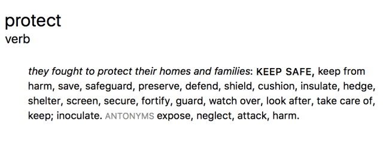
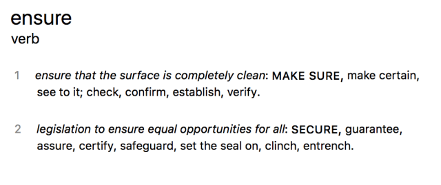
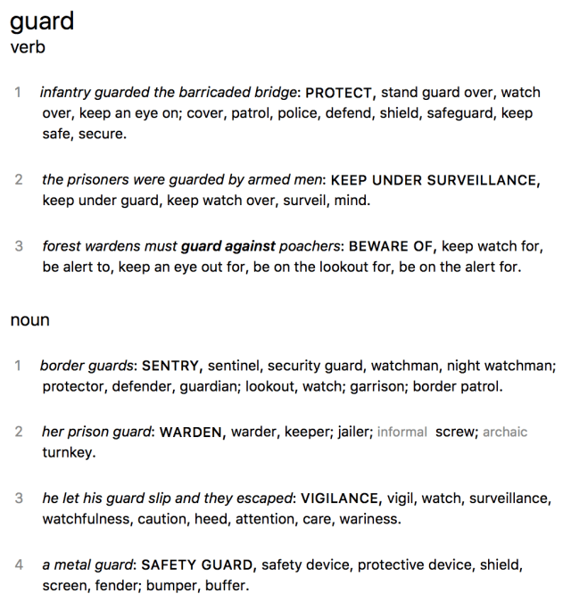
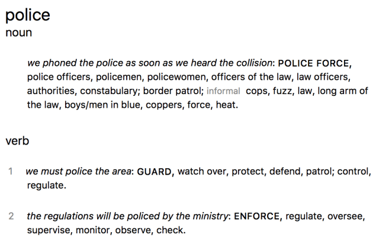

프로그래밍이 선사하는 진정한 기쁨중 하나는 좋은 변수, 메소드, 클래스명을 떠올리는 것이다. 그것보다 더 즐거운 기쁨을 꼽자면, 당신이 작성한 명칭들이 각각 상황과 맥락에 정확하게 맞아 떨어지는 것이다. 그 중에서도 좋은 네이밍이 선사 해주는 가장 좋은 점은 서로 다른 방향으로 향하는 여러 힘을 절충해야 할 때이다. 이 글은 바로 그 경우에 대한 이야기이다.

첫시작은 간단한 코드 리팩토링이었다. 우리는 이미지, 동영상 및 트위터 URL과 같은 임의의 URL 데이터를 가져와서 인라인으로 보여주는 형태의 기능을 `Basecamp 3`의 채팅방에서 할 수 있게끔 제공하려고 작업중이었다. 이 기능에서 한가지 보안에 대한 우려가 있었는데, 그것은 `127.0.0.1` 과 같이 내부 IP가 우리가 설계 해 놓은 `Downloader` 클래스의 다른 보안 조치들을 우회 할 수도 있다는 것이었다. 그래서 이러한 내부 IP들을 허용하지 않는 방향으로 메소드를 설계하고 있었다.

해당 정책은 원래 `Downloader` 클래스에 국한 되었던 것이어서 그렇게 중요한 것이 아니었는데, 개발중인 웹훅 API에도 적용될 예정이라 고민이 되었다. 그 이유는 채팅방의 URL 스니펫 처럼 웹훅에서도 유저들에게 URL을 설정하고 우리 시스템을 호출 할 수 있게끔 허용해야 했기 때문이다. 결국 근본적으로 동일한 보안 이슈를 다루고 있었다.

딱히 문제될건 없었다. 그냥 보안 관련 코드들을 추출하여 모듈로 만든 뒤 해당 위치에서 호출하면 될일이다. 해당 기능을 수행할 모듈에 처음 부여한 명칭은 `PrivateNetworkProtector` 였다. 꽤 괜찮아 보였으나 모듈의 메소드를 호출하고 나니 생각이 달라졌다.

```rb
PrivateNetworkProtector.protect_against_internal_ip_address(ip)
PrivateNetworkProtector.verify_ip_address_isnt_private(ip)
```
흠... 둘다 그렇게 좋아보이진 않았다. 두 예시 모두 쓸데없이 길고 부정어가 들어가있었다. 생각해보니 `Protector`라는 단어또한 마음에 들지 않았다. `Protection`이라는 단어가 들어가 있으니 무언가 서지 보호기(surge protector: 과도전압을 제어하는 데 쓰이는 도구로, 낙뢰, 지락, 한전으로부터 전력설비를 보호하는 데 쓰인다. 소스: 나무위키)처럼 예상치 못한 입력값을 원천적으로 차단하는 느낌이다. 해당 메소드는 전혀 그런 기능이 아니다. 단지 비정상적인 접근 시도를 감시하는 것이기에 좀 더 나은 단어가 효과적일 것이다. 위험이 아닌 위협에 좀 더 중점을 두자.

프로그래머의 베스트프랜드인 시소러스(thesaurus: 단어를 의미에 따라 분류·배열한 일종의 유의어(類義語)/반의어(反義語) 사전. 소스: 구글)를 살펴보면 다음과 같다.



많은 대안들을 중에서 `Guard`라는 단어가 끌렸다. `PrivateNetworkGuard`로 바꿔보자. 음... 체격 좋은 남자가 정중하게 입장전 검사를 하는 느낌이다. 내가 원하는 느낌이다. 이제 메소드명을 다시한번 생각해보자. 기존 예시에서 모듈 네임을 바꾸어서 다시 한번 살펴보자.

```rb
PrivateNetworkGuard.guard_against_internal_ip_address(url)
PrivateNetworkGuard.verify_ip_address_isnt_private(url)
```

둘다 여전히 아니다. `guard` 라는 단어를 반복해서 쓸수는 있지만, 생일 폭죽을 두번 연속으로 터트리는것 마냥 눈에 거슬린다. `Action Controller` 에서 사용되는 `before_action` 같이 사전에 작동하여 걸러주는 느낌을 준다면 어떨까? 뭔가 좀 더 와닿는다!

```rb
PrivateNetworkGuard.ensure_public_ip_address(url)
PrivateNetworkGuard.ensure_no_private_ip_address(url)
```

여전히 아니다. `ensure` 라는 동사는 뭔가 `Guard` 처럼 위압적이고 힘있는 단어와 어울리지 않는다. 너무 매가리가 없다. 캐쥬얼한 느낌의 권한 검사가 아니다. 이건 여기서 걸리면 바로 예외 처리 되면서 그 요청을 잡아내는 거니깐! 

그러한 생각들의 꼬리가 [`Eiffel`](https://en.wikipedia.org/wiki/Eiffel_%28programming_language%29) 이라는 언어에서 채택한 [`계약 프로그래밍(Design by contract)`](https://en.wikipedia.org/wiki/Design_by_contract) 을 떠올리게 했다. 위키피디아에 들어가서 좋은 단어가 있는지 살펴보자. `Eiffel` 역시 루비와 동일하게 `require` 를 선제조건들을 설정할때 사용하고 있었다. `require` 역시 마음에 들지 않았다. 
```rb
 PrivateNetworkGuard.require_public_ip
```
이건 뭔가 열정은 넘치지만 연기를 못하는 배우에게 하나하나 짚어주는 느낌이다. 이건 그렇게 어리숙한 대상이 아니라 악의를 가진 대상을 겨냥한다. 이번엔 `ensure` 에 대한 동의어를 찾아보자.



별로 마음에 드는 동의어가 없다. 내말은 모두 그럭저럭 괜찮지만 마음에 와닿는게 없다는 것이다. 처음부터 이 모든 작업 또한 내 마음에 맞는 단어 찾는거였으니 그럭저럭 괜찮은 단어보단 `"그래 이거야!!!"` 감탄 할만큼 꼭 내마음에 드는 단어를 찾고싶다. 흠... 그렇다면 `Guard` 의 동의어는 어떤 것들이 있는지 살펴보자.



여기에도 없다. 그러나 완전 수확이 없는 것은 아니다. 여기 `Police` 라는 단어가 괜찮아 보인다. 우리 설계에서 `Guard` 는 내부 ip 주소가 들어오는지 감시하는 역할이다. 그렇다면, `Police` 에서 한번 찾아보자! 



`ENFORCE`! 바로 이느낌을 원했다!! 바로 한번 적용해보자.

```rb
PrivateNetworkGuard#enforce_public_ip(url)
PrivateNetworkGuard#enforce_no_private_ip(url)
```

의무적인 표현을 부각시킨다는 점에서 보면 부정어가 들어간 예시가 좀 더 좋아보인다. 왜냐면 이 메소드는 공개된 소스를 검사 하는 느낌보다는 내부 ip에서 유입되는 악성 URL을 잡는 느낌이기 때문이다. 동전의 양면과도 같지만, 분명히 구분해야하는 중요한 요소이다.

결국 나는 `PrivateNetworkGuard#enforce_public_ip(url)` 를 쓰기로 했다. 그래도 부정적인 느낌의 명칭보다는 긍정적인 메소드 이름이 더 나아보였기 때문이다. 두가지 미묘한 장단점 중에서 우리가 기존에 우려했던 요소를 명시하는 것이 더 중요하다고 생각했다. 

좀 더 나은 모듈명과 메소드명을 짓느라 엄청난 노력을 했지만 여기서 진정한 프로그래밍의 즐거움을 느낀다. 단지 대충 지은 명칭이 아니라 근사한 명칭을 위해 정성을 들였다. 아마 이 모든 과정이 5분만에 해결되었을 수도 있었을 것이다. 나는 이 모든 모험이 단순히 시간낭비로 여기지 않고 노는것 마냥 즐겼다. 프로그래밍은 정말 근사하지 않는가?
<br/>
<br/>
<br/>

## *해당 글은 Basecamp 창업자이자 CTO인 DHH의 블로그 에세이입니다. 오역과 초월번역이 난무할 수 있으니 읽으실때 감안해 주셨으면 합니다. 😅*

Original Source:
[Hunting for great names in programming](https://m.signalvnoise.com/hunting-for-great-names-in-programming/)
