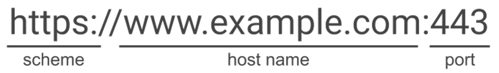
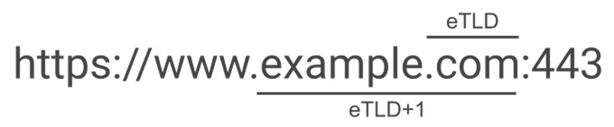
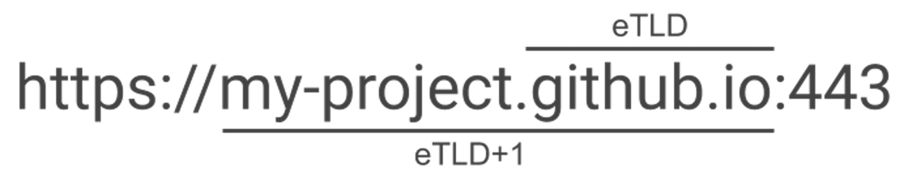
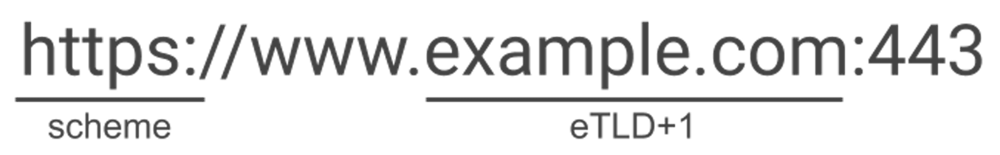

## "same-site" 와 "same-origin" 이해하기

"same-site" 와 "same-origin" 은 빈번하게 언급되지만 사람들이 잘못 이해하고 있는 용어이다. 이 헤더 요소들은 컨텍스트 페이지 트렌지션, fetch() 요청, 쿠기, 팝업창, 소스 임베딩, iframe 등이 호출될 때 함께 나타난다.

### Origin

"Origin" 은 [스킴](https://developer.mozilla.org/en-US/docs/Web/HTTP/Basics_of_HTTP/Identifying_resources_on_the_Web#scheme_or_protocol) (또는 프로토콜이라고 칭함. 예: HTTP, HTTPS) 과 [호스트명](https://en.wikipedia.org/wiki/Hostname), [포트](https://developer.mozilla.org/en-US/docs/Web/HTTP/Basics_of_HTTP/Identifying_resources_on_the_Web#port) (포트가 명시되어 있는 경우에)로 구성되어있다. 예를 들면 `https://www.example.com:443/foo` 이라는 주소가 있다면 여기서 "origin"은 `https://www.example.com:443`. 이다.

### "same-origin" 과 "cross-origin"
동일한 스킴, 호스트명, 포트를 가진 웹사이트를 우리는 "same-origin" 이라고 일컫는다. 그 이외의 주소는 전부 "cross-origin" 으로 간주한다.

#### 예시

|Origin A|Origin B|"same-origin" 또는 "cross-origin" 여부|
|--------|--------|-------------------------------------------------------------------------|
|https://www.example.com:443|https://www.evil.com:443   https://example.com:443  	https://login.example.com:443   http://www.example.com:443   https://www.example.com:80	  https://www.example.com:443   https://www.example.com| cross-origin: 다른 도메인   cross-origin: 다른 서브도메인  	cross-origin: 다른 서브도메인   cross-origin: 다른 스킴(HTTP)   cross-origin: 다른 포트   same-origin: 정확히 일치   same-origin: 포트 번호(443)을 제외한 일치|

### Site

`.com` 이나 `.org` 같은 최상위 도메인(TLD)들은 [루트 서버 데이터베이스](https://www.iana.org/domains/root/db) 에 저장 및 관리되고 있다. 위 사진의 예시처럼 웹사이트 주소는 최상위 도메인과 그 앞에 위치한 도메인 주소의 결합이다. 따라서 `https://www.example.com:443/foo` 의 사이트 주소는 `example.com` 이다.

이와 다르게 `.co.jp` 나 `.github.io` 같은 사이트 주소는 단순히 `.jp`, `io` 와 같은 최상위 도메인의 조합 만으로 스스로 사이트 주소임을 증명하기 힘들다. 이러한 도메인 형태는 단독으로 고유 사이트 주소를 증명 할 수 있는 알고리즘 수단 또한 없다. 이런 문제 때문에 일반 최상위 도메인(eTLD 또는 gTLD) 리스트가 만들어졌다. 해당 접미사 리스트는 [Public Suffix List](https://wiki.mozilla.org/Public_Suffix_List) 에 등록되어 관리되고 있다. (참고: [publicsuffix.org/list](https://publicsuffix.org/list/))

이러한 형태의 사이트 주소명은 통상적으로 eTLD+1 이라 칭한다. 예를 들어, `https://my-project.github.io` 라는 사이트의 eTLD는 `github.io` 이며 통상 사이트 주소로 일컫어지는 eTLD+1은 `my-project.github.io` 이다. 다시말해 eTLD+1 은 우리가 일반적으로 사용하는 사이트 주소명에 최상위 도메인이 결합된 형태이다.

### "same-site" 와 "cross-site"
우리는 동일한 eTLD+1 을 가진 사이트 주소를 "same-site" 라고 칭한다. 다른 모든 eTLD+1 조합들은 "cross-site" 로 칭한다.

|Origin A|Origin B|"same-site" 또는 "cross-site" 여부|
|--------|--------|-------------------------------------------------------------------------|
|https://www.example.com:443|https://www.evil.com:443  	https://login.example.com:443   http://www.example.com:443   https://www.example.com:80	  https://www.example.com:443   https://www.example.com| cross-site: 다른 도메인   same-site: 다른 서브도메인이나 동일하게 취급   same-site: 다른 스킴이나 동일하게 취급   same-site: 다른 포트주소 이지만 동일하게 취급   	same-site: 완벽히 일치   same-site: 포트 주소가 없으나 동일하게 취급|

### "schemeful same-site"

"same-site" 의 정의는 URL 제일 앞에 위치한 스킴 또한 하나의 속성으로 취급하면서 한 단계 허들을 높였다. 이러한 정책을 도입하 이유는 [HTTP 보안 취약점을 약한 채널로 취급 하는 것](https://datatracker.ietf.org/doc/html/draft-west-cookie-incrementalism-01#page-8)을 방지하기 위함이다. 브라우저들이 이러한 정책을 따르기 시작하면서 이전의 정의를 "scheme-less same-site"로 정의하고 ["schemeful same-site"](https://web.dev/schemeful-samesite/)를 새로운 "same-site" 정책으로 변경했다. 이 경우 `http://www.example.com` 와 `https://www.example.com` 은 다른 스킴(HTTP vs HTTPS) 을 사용하기 때문에 "cross-site" 로 취급한다.

|Origin A|Origin B|"schemeful same-site" 여부|
|--------|--------|-------------------------------------------------------------------------|
|https://www.example.com:443|https://www.evil.com:443  	https://login.example.com:443   http://www.example.com:443   https://www.example.com:80	  https://www.example.com:443   https://www.example.com| cross-site: 다른 도메인   schemeful same-site: 다른 서브도메인이나 동일하게 취급   cross-site: 다른 스킴   schemeful same-site: 다른 포트주소이지만 동일하게 취급   schemeful same-site: 정확히 일치   chemeful same-site: 포트주소가 없으나 동일하게 취급|

### "same-site", "same-origin", "cross-origin" 에 따른 요청 처리

크롬 브라우저는 `Sec-Fetch-Site` 헤더를 요청에 함께 실어 보낸다. 원문의 글을 작성했던 2020년 4월 까지 `Sec-Fetch-Site` 헤더를 지원하는 브라우저는 아직 없었다. 이는 larger [Fetch Metadata Request Headers](https://www.w3.org/TR/fetch-metadata/) 제안의 일부로 진행되었다. `Sec-Fetch-Site` 헤더는 아래와 같은 값을 전송한다.

* `cross-site`
* `same-site`
* `same-origin`
* `none`

`Sec-Fetch-Site` 값을 확인함으로써 "same-site", "same-origin", "cross-site" 를 정확하게 구분 할 수 있다. ("schemeful-same-site" 는 `Sec-Fetch-Site` 헤더로 구분 할 수 없다.)

Original Source:
[Understanding "same-site" and "same-origin"](https://web.dev/same-site-same-origin/)
