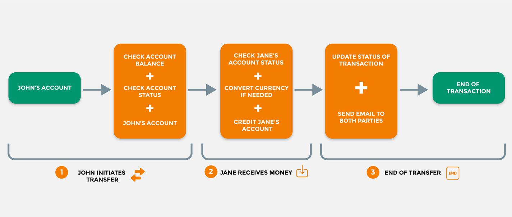
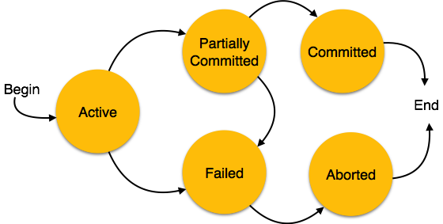

레일즈 개발자라면 당신의 앱이 다음 두가지 문제를 가지고 있지 않기를 바랄것이다.

* **데이터 무결성** - DB에 존재하는 데이터가 완전무결한가?
* **DB 성능** - 쿼리의 성능 및 속도가 안전한 수준인가?

DB 트랜잭션및 그와 관련된 `ActiveRecord` 기능들은 이러한 문제들을 해결하는데 효과적인 도구다. 적절하게 사용만 한다면 쿼리의 속도와 데이터 무결성을 보장 해 줄 수 있다.

이 글은 DB 트랜잭션에 대한 컨셉을 소개하고자 한다. 여기서 트랜잭션을 Rails에서 어떤식으로 사용하는것 뿐만 아니라 언제 트랜잭션을 사용해야 되는지 또한 함께 다룰 예정이다.

트랜잭션의 한가지 멋진 장점은 DB에서 실행 된다는 것이다. Postgres, MySQL과 같이 DB 종류와 상관없이 사용 할 수 있다. Rails 개발자가 아니여도 여기서 기술하는 내용들을 이해하면 손쉽게 트랜잭션을 사용 할 수 있을 것이다.

## 트랜잭션이란 무엇인가?

트랜잭션은 앱이 요청 수행 도중 문제가 발생하더라도 데이터 무결성을 보장해야 되는경우에 사용된다.

[Rails API 문서](https://api.rubyonrails.org/classes/ActiveRecord/Transactions/ClassMethods.html) 에서 다음과 같이 트랜잭션을 설명하고 있다.

```text
트랜잭션은 각 SQL문이 하나의 원자적 행위 (수행 도중 중단될 수 없는 하나의 동작 단위를 의미함)로 성공 할 시 영구적으로 저장을 실행하는 보호 블럭을 의미한다.
전형적인 예로 한 계좌에 잔고가 있을 경우에 출금이 되는 계좌간 입출금 서비스를 들 수 있다.
트랜잭션은 DB의 무결성을 강화하고 프로그램 에러나 DB 중단 등의 이벤트로 부터 데이터를 보호한다.
기본적으로 다른 SQL문들이 함께 실행되어야만 하는 경우에는 반드시 트랜잭션을 사용해야한다.
```

## 전형적인 예시
트랜잭션이 왜 유용한지 알아보기 위해 다음의 예시를 들겠다.

송금 서비스를 제공하는 뱅킹 시스템을 구축한다고 생각해보자. 여기서 시카고에 살고있는 철수가 런던에 있는 영희에게 200불을 송금한다고 했을 때, 우리는 몇가지 명령을 DB에 전달 할 것이다.

1. 철수의 계좌에서 200불이 있는지 확인한다.
2. 철수의 계좌에서 200불을 출금한다.
3. 200불을 영희가 살고있는 나라의 화폐단위인 파운드로 환전한다.
4. 철수의 계좌에 200불 출금 기록을 남긴다.
5. 출금액을 전송한다.



## 중대한 문제
어리숙하게 시스템을 구현하면 다음과 같은 코드처럼 구성 할 것이다.

```rb
sender.debit_account(amount) if sender.sufficient_balance(amount)
credit_amount = convert_currency(amount, recipient)
perform_transfer(recipient, credit_amount, sender)
```
만약 우리 시스템이 환전 중에 문제가 발생한다면 어떻게 될까? 이는 중대한 문제이다.

**철수의 계좌에서 돈이 출금된 이후 영희의 계좌에 추가되기 이전이라면?**

**그 돈은 허공에 증발해 버릴것이다.**

우리는 완료되지 않은 데이터를 DB에 저장하고 기록하는 것을 방지하기 위해 에러를 발생시키고 DB를 롤백 하는 방법을 적용해야 한다. 모든 DB 행위들이 수행 되거나 아예 수행되지 않는 방향으로 말이다.

위 예시 코드를 트랜잭션으로 감싸는 것이 데이터 무결성을 보장하는 가장 이상적인 방법이다.

레일즈에서는 다음 코드와 같을 것이다.

```rb
Transfer.transaction do
  sender.debit_account(amount) if sender.sufficient_balance(amount)
  credit_amount = convert_currency(amount, recipient)
  perform_transfer(recipient, credit_amount, sender)
end
```

이제 기록을 생성하거나 업데이트 하더라도 트랜잭션을 완전히 통과하지 않는 한 DB에 반영되지 않을 것이다.

## DB트랜잭션 상태

트랜잭션은 아주 명확한 라이프사이클을 가지고 있다. 어느 시점이든 시스템 상의 트랜잭션은 특정한 상태에 놓여져 있을 것이다.



*Database Transaction StatesSource: https://www.tutorialspoint.com*

* 실시간: DB 명령이 수행되고 있음.
* 부분적으로 완료됨: DB 명령이 성공적으로 완료되었으나 데이터가 DB에 적용되지 않았으며, 트랜잭션 외부에서 접근이 불가능함.
* 적용: DB 명령이 성공적으로 완료되었고 DB에 데이터가 저장되었음.
* 실패: 에러가 일어나서 트랜잭션을 중단시킴. DB는 아직 롤백 되지 않은 상태.
* 취소: 실패 이후 DB가 롤백 되었으며, 트랜잭션이 중단되었음.

## ActiveRecord 상에서의 트랜잭션

위에 앞서 보았던 계좌송금 코드는 다음과 같다.

```rb
ActiveRecord::Base.transaction do
  sender.debit_account(amount) if sender.sufficient_balance(amount)
  credit_amount = convert_currency(amount, recipient)
  perform_transfer(recipient, credit_amount, sender)
  transfer.update_status
end
```

레일즈에서는 `ActiveRecord::Base` 클래스를 통하여 트랜잭션 메소드를 호출하고 검증한다. 해당 블럭 안에서 호출되는 모든 DB명령은 트랜잭션으로 간주되어 보내 질 것이다.

만약 해당 블럭 안에서 미리 처리되지 않은 에러가 발생할 경우 트랜잭션은 취소되고 DB 상에 업데이트는 이루어 지지 않을 것이다.

## ActiveRecord::Base#transaction

위 예시에서는 `ActiveRecord:Base` 클래스에서 트랜잭션 메소드를 호출했다. 컨트롤러나 다른 서비스 단에서 아마 이런식으로 구현하고 있을 당신을 발견하게 될 것이다.

모든 `ActiveRecord` 모델은 트랜잭션 메소드이다. `ActiveRecord`에서 상속된 `Transfer` 클래스가 있다고 가정한다면, 다음 예시도 동일하게 동작한다.

```rb
Transfer.transaction do
  ...
end
```

## my_model_instance#transaction

모든 `ActiveRecord` 모델에서 생성된 인스턴스들 또한 트랜잭션 메소드를 가지고 있다.

```rb
transfer = Transfer.new(...)
transfer.transaction do
  ...
end
```

트랜잭션 메소드는 또한 `Ruby` 메소드의 일종이기 때문에 모델 정의에서 참조 할 수 있다.

```rb
class Transfer < ApplicationRecord
  def perform(...)
    self.transaction do
      ...
    end
  end
end
```

## 트랜잭션을 취소하는 방법

수동으로 트랜잭션을 취소하고 업데이트가 DB에 적용되는 것을 방지하려면 `ActiveRecord::Rollback` 메소드를 사용하면 된다.

```rb
ActiveRecord::Base.transaction do
  @new_user = User.create!(user_params)
  @referrer = User.find(params[:referrer_id])
  raise ActiveRecord::Rollback if @referrer.nil?
  @referrer.update!(params[:reference_record])
end
```

## 트랜잭션 예외처리

트랜잭션 내에서 예외 처리 되지 않은 에러는 트랜잭션을 취소시킨다. 예외처리를 하는 방법은 크게 두가지이다.

* ActiveRecord 메소드 끝에 !를 사용 에) `save!`, `update!`, `destroy!` 등
* 수동으로 예외처리 하는 방법

`ActiveRecord` 클래스 메소드 중 !로 끝나는 메소드는 실패 할 시 즉각 예외처리를 한다.

다른 유저의 기록을 업데이트 하는동안 새로운 유저를 생성하는 트랜잭션을 만든다고 가정해보자.

```rb
ActiveRecord::Base.transaction do
  @new_user = User.create!(user_params)
  @referrer.update!(params[:reference_record])
end
```

`create!` 와 `update!` 메소드는 에러가 발생할 시 예외처리를 할 것이다. 
만약 `!` 가 없는 메소드로 유저를 생성하고 업데이트 한다고 하면 해당 메소드가 실패하면서 값을 리턴하고 트랜잭션은 그대로 진행 될 것이다. 물론 수동으로 예외처리를 할수도 있다.

```rb
ActiveRecord::Base.transaction do
  @new_user = User.create(user_params)
  raise ActiveRecord::RecordInvalid unless @new_user.persisted?
  ...
end
```
어떤 예외처리를 할 것인지는 상관이 없이 해당 트랜잭션은 취소 될 것이다.

필요한 경우 `rescure`를 예외처리 할 때 사용하는 것을 잊지 말자.

```rb
def create_referrer_account
  ActiveRecord::Base.transaction do
    ...
    raise ActiveRecord::RecordInvalid if @referrer.nil?
  rescue ActiveRecord::RecordInvalid => exception # handle error here...
  end
end
```

## 트랜잭션 중첩

우리가 여기까지 알아본 트랜잭션 기능의 예시들은 오직 하나의 DB와 통신하는 경우였다. 대부분의 Rails 앱들이 하나의 DB만 사용을 하기 때문에 큰 무리 없이 잘 동작할 것이다.

그러나 여러 DB를 사용하여 데이터 무결성을 보장해야하는 경우, `ActiveRecord`의 트랜젹선을 중첩으로 사용하여 해결 할 수 있다.

아래 예시는 `User` 와 `Referrer` 모델이 서로 다른 DB에 존재하는 경우이다.

```rb
User.transaction do
  @new_user = User.create!(user_params)
  Referrer.transaction do
    @referrer.update!(params[:reference_record])
  end
end
```

내부에 감싸진 어느 트랜잭션이 실패하든간에 외부에 존재하는 트랜잭션 또한 취소하게끔 동작 할 것이다.

하지만 반드시 명심해야 할 것은 중첩 트랜잭션은 제대로 사용하기 까다롭다는 것이다. 이러한 경우를 피하는 것이 가장 최선의 방법이다.

## 트랜잭션의 단점
우리의 삶처럼 프로그래밍에서는 공짜라는건 거의 없다. 트랜잭션은 데이터 무결성을 보장하는 완벽한 방법이나 몇가지 단점 또한 존재한다.

* 성능 - 트랜잭션은 일반 쿼리문보다 DB 서버의 자원을 많이 소모한다.
* 복잡성 - 트랜잭션을 남발하면 코드가 난해하고 유지보수하기 힘들어진다.

예를 들어 트랜잭션을 레일즈에서 사용하는 경우 트랜잭션 블럭 내부에 있는 모든 명령이 완료되기 전까지 DB 연결 하나를 점유하고 있을 것이다. 해당 블럭의 속도가 느리다면 어마어마한 시간동안 DB 연결을 유지하고 있을 것이다.

```rb
ActiveRecord::Base.transaction do
  User.create!(user_params)
  SomeAPI.do_something(u)
end
```

트랜잭션을 잘 사용하는 핵심은 반드시 필요할 때만 사용하는 것이다.


## 결론

```큰 힘에는 큰 책임이 따른다.```

트랜잭션은 개발자에게 SQL문을 올바르게 쓸 수 있도록 힘을 빌려준다. 동시에 트랜잭션을 이곳저곳에 남발하면 안된다는 큰 책임을 동반하고 있다.

추가로 필자가 트랜잭션을 사용을 고려할 때 항상 확인하는 체크리스트가 있다. 그 내용은 다음과 같다.

1. 하나 이상의 SQL문을 다루어야 하는가?
2. 해당 SQL문들이 함께 성공해야 하는가?

트랜잭션을 사용할 때 위에서 보있듯이 항상 예외처리 하는것 또한 잊지 말자.

Original Source:
[Understanding Database Transactions in Rails](https://www.honeybadger.io/blog/database-transactions-rails-activerecord)