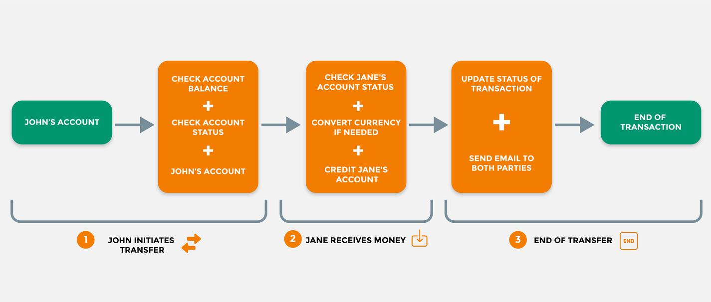
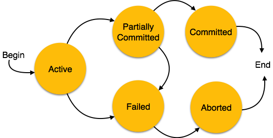

레일즈 개발자라면 당신의 앱이 다음 두가지 문제를 가지고 있지 않기를 바랄것이다.

* **데이터 무결성** - DB에 존재하는 데이터가 완전무결한가?
* **DB 성능** - 쿼리의 성능 및 속도가 안전한 수준인가?

DB 트랜잭션및 그와 관련된 `ActiveRecord` 기능들은 이러한 문제들을 해결하는데 효과적인 도구다. 적절하게 사용만 한다면 쿼리의 속도와 데이터 무결성을 보장 해 줄 수 있다.

이 글은 DB 트랜잭션에 대한 컨셉을 소개하고자 한다. 여기서 트랜잭션을 Rails에서 어떤식으로 사용하는것 뿐만 아니라 언제 트랜잭션을 사용해야 되는지 또한 함께 다룰 예정이다.

트랜잭션의 한가지 멋진 장점은 DB에서 실행 된다는 것이다. Postgres, MySQL과 같이 DB 종류와 상관없이 사용 할 수 있다. Rails 개발자가 아니여도 여기서 기술하는 내용들을 이해하면 손쉽게 트랜잭션을 사용 할 수 있을 것이다.

## 트랜잭션이란 무엇인가?

트랜잭션은 앱이 요청 수행 도중 문제가 발생하더라도 데이터 무결성을 보장해야 되는경우에 사용된다.

[Rails API 문서](https://api.rubyonrails.org/classes/ActiveRecord/Transactions/ClassMethods.html) 에서 다음과 같이 트랜잭션을 설명하고 있다.

```text
트랜잭션은 각 SQL문이 하나의 원자적 행위 (수행 도중 중단될 수 없는 하나의 동작 단위를 의미함)로 성공 할 시 영구적으로 저장을 실행하는 보호 블럭을 의미한다. 전형적인 예로 한 계좌에 잔고가 있을 경우에 출금이 되는 계좌간 입출금 서비스를 들 수 있다. 트랜잭션은 DB의 무결성을 강화하고 프로그램 에러나 DB 중단 등의 이벤트로 부터 데이터를 보호한다. 기본적으로 다른 SQL문들이 함께 실행되어야만 하는 경우에는 반드시 트랜잭션을 사용해야한다.
```

## A Classic Example
To illustrate why transactions are useful, let's consider a possible scenario.

Imagine that we are building a banking system that lets people transfer money. When John Doe (in Chicago) sends \$200 to Jane Doe (in London), we perform several DB operations.

1. Check that John Doe has \$200 in his account.
2. Debit the total amount from his account.
3. Convert \$200 to Jane Doe's preferred currency, which is pounds.
4. Credit Jane Doe's account.
5. funds transfer



An expensive problem
Implemented naively, our code might look like this:

```rb
sender.debit_account(amount) if sender.sufficient_balance(amount)
credit_amount = convert_currency(amount, recipient)
perform_transfer(recipient, credit_amount, sender)
```
What happens if our program crashes during the currency conversion? It's a crucial spot:

* After money has been taken out of John's account
* ...and before it's added to Jane's?


**The money vanishes into thin air.**

We need some way to ensure that errors along the way cause the database to roll back to avoid committing incomplete data. Either all of the database actions are performed, or none of them are.

Wrapping the above queries in a database transaction is your best bet for achieving data integrity.

In Rails, it might look like this:

```rb
Transfer.transaction do
  sender.debit_account(amount) if sender.sufficient_balance(amount)
  credit_amount = convert_currency(amount, recipient)
  perform_transfer(recipient, credit_amount, sender)
end
```

Now, even though we might be creating and updating records, the supposed changes are not reflected in the database until the transaction is completed successfully.

### States of Database Transaction
Transactions have a well-defined life cycle. At any point in time, your transaction will be in a specific state.



*Database Transaction StatesSource: https://www.tutorialspoint.com*

* Active: Our DB operations are being executed.
* Partially Committed: Our DB operations have completed successfully, but changes have not been committed to the database, and cannot be accessed outside of the transaction.
* Committed: Our DB operations have completed successfully and saved any changes to the DB.
* Failed: Some error has occurred, which caused the DB to stop the transaction. The DB has not been rolled back at this point.
* Aborted: The DB has been rolled back after a failure, and the transaction is done.


### Transactions in ActiveRecord
We previously saw that our bank transfer code looked like this:

```rb
ActiveRecord::Base.transaction do
  sender.debit_account(amount) if sender.sufficient_balance(amount)
  credit_amount = convert_currency(amount, recipient)
  perform_transfer(recipient, credit_amount, sender)
  transfer.update_status
end
```

We're calling the transaction method on the ActiveRecord::Base class and passing it a block. Every database operation that happens inside that block will be sent to the database as a transaction.

If any kind of unhandled error happens inside the block, the transaction will be aborted, and no changes will be made to the DB.

### ActiveRecord::Base#transaction
In the above example, I am calling the transaction method on the ActiveRecord::Base class. You might find yourself doing this in controller or service code.

Every ActiveRecord model has a transaction method. Imagine that you have a Transfer class that inherits from ActiveRecord. The following works:

```rb
Transfer.transaction do
  ...
end
```

### my_model_instance#transaction
Every instance of your ActiveRecord models, also has its own transaction method.

```rb
transfer = Transfer.new(...)
transfer.transaction do
  ...
end
```
And, because the transaction method is an ordinary Ruby method, we can reference it in our model definitions:

```rb
class Transfer < ApplicationRecord
  def perform(...)
    self.transaction do
      ...
    end
  end
end
```

### How to Abort Transactions
To manually abort a transaction and prevent any of its changes from being written to the DB, you can use the ActiveRecord::Rollback method.

```rb
ActiveRecord::Base.transaction do
  @new_user = User.create!(user_params)
  @referrer = User.find(params[:referrer_id])
  raise ActiveRecord::Rollback if @referrer.nil?
  @referrer.update!(params[:reference_record])
end
```

### Exceptions During Transactions
Any unhandled exception that occurs during the transaction will also cause it to be aborted. There are two common ways to raise these exceptions:

* Using ActiveRecord methods ending with an exclamation-mark: save!, update!, destroy! etc.
* Manually raising an exception

In ActiveRecord, when a method name ends with an exclamation-mark (also called a "bang"), it will raise an exception on failure.

Let's say we have a transaction that involves creating a new user account, while also updating the record of another user (the referrer):

```rb
ActiveRecord::Base.transaction do
  @new_user = User.create!(user_params)
  @referrer.update!(params[:reference_record])
end
```

The create! and update! methods will raise an exception if something goes wrong.

If we were to use the create and update methods (without the exclamation mark), they would indicate a failure via their return value, and the transaction would keep running.

Of course, we could always check the return value ourselves and "manually" raise an exception if we wanted to:

ActiveRecord::Base.transaction do
  @new_user = User.create(user_params)
  raise ActiveRecord::RecordInvalid unless @new_user.persisted?
  ...
end
It doesn't matter what kind of exception you raise. Any exception class will abort the transaction.

Don't forget to rescue the exception if you need to.

```rb
def create_referrer_account
  ActiveRecord::Base.transaction do
    ...
    raise ActiveRecord::RecordInvalid if @referrer.nil?
  rescue ActiveRecord::RecordInvalid => exception # handle error here...
  end
end
```

### Nested Transactions
The transactions we've seen so far only allow you to work with a single database. Most Rails apps only use one database, so that works out nicely.

If you need to ensure data integrity across multiple databases, you can do so by nesting ActiveRecord transactions.

In the example below, imagine that the User and Referrer models point to different databases.

```rb
User.transaction do
  @new_user = User.create!(user_params)
  Referrer.transaction do
    @referrer.update!(params[:reference_record])
  end
end
```

If any parts of the inner transaction fail, it will cause the outer transaction to be aborted.

Beware, though, that nested transactions can be tricky to get right. It's best to avoid them if you can.

### Transaction Tradeoffs
In programming, as in life, very few things are free. Transactions give us an excellent way to ensure data integrity, but they have a few possible drawbacks:

* Performance - Using a transaction will consume more resources on the DB server than the raw queries.
* Complexity - When overused, transactions can make your code more brittle and harder to understand.

For example, when you use a transaction in Rails, it ties up one of your DB connections until all the code in your transaction block finishes running. If the block contains something slow, like an API call, you could tie up a DB connection for an unreasonable amount of time.

```rb
ActiveRecord::Base.transaction do
  User.create!(user_params)
  SomeAPI.do_something(u)
end
```
The key to using transactions well is to use them only when you really need them.

### Conclusion
```With great power comes great responsibility.```

Transactions give developers the power to write SQL statements in the right way. This power has a great responsibility attached to it - one that should not be abused by sprinkling transactions everywhere.

In addition to what we have learned, here is a checklist I came with for when I use transactions:

1. Do I need to handle more than one SQL statement?
2. Do I need the SQL statement to succeed together?

While you make use of transactions, ensure you're raising and rescuing the errors as we saw above.


Original Source:
[Understanding Database Transactions in Rails](https://www.honeybadger.io/blog/database-transactions-rails-activerecord)