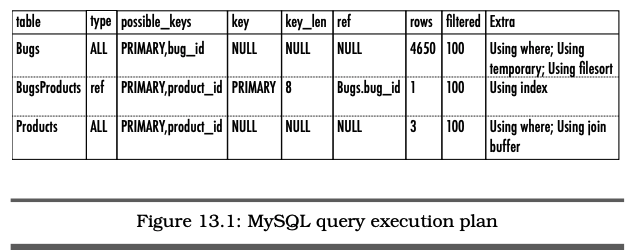

# Chapter 13 Index Shotgun (인덱스 샷건)

## 목표 - 성능 최적화 하기
데이터베이스 성능 최적화는 백엔드 개발자라면 항상 고민하고 있는 포인트이다. 신뢰성, 보안, 정합성 모든것을 고려할 때 항상 반대 급부로 물어보는 항목이기도 하다. 이러한 물음의 가장 기본적이고 간단한 대답은 인덱스를 사용하는 것이다. 인덱스는 조건에 맞는 컬럼에 연관된 데이터를 불리오기 위한 데이터 구조이다. 인덱스를 사용하면 [브루트 포스 방식](https://en.wikipedia.org/wiki/Brute-force_search)(모든 데이터 값을 조회하여 조건에 맞는 데이터를 도출하는 알고리즘.) 보다 훨씬 더 빠르고 효율적으로 데이터를 조회 할 수 있다.

대부분의 개발자들은 인덱스를 어떻게 어떤식으로 사용하는지 제대로 이해하고 있지 못하고 있다. 대부분의 문서나 책들은 인덱스를 어떻게 효율적으로 사용할 수 있는지 제대로 언급해 주지 않기 때문이다. 단지 어떤식으로 인덱스를 사용해야 할지 추측 할 뿐이다.

## 안티패턴 - 계획 없이 무차별적으로 인덱스 사용하기
인덱스를 오직 추측만으로 사용하게 된다면 대게 잘못된 경우로 사용하게 된다. 가장 일반적인 문제 세가지를 언급하고자 한다.

* 인덱스를 선언하지 않거나 너무 조금만 사용하는 경우
* 인덱스를 너무 많이 선언하거나 도움되지 않게끔 사용하는 경우
* 인덱스가 없는 컬럼을 사용하여 쿼리를 실행하는 경우

### 인덱스가 없는 경우
인덱스를 항상 최신 상태로 유지하기 위해 오버헤드가 발생하는 사실은 우리는 인지하고 있다. `INSERT`, `UPDATE`, `DELETE` 문을 실행할 때마다 데이터베이스는 인덱스 무결성을 보장해주기 위해 함께 업데이트 한다.

우리는 일반적으로 오버헤드는 나쁜 요소로 이해하고 있다. 따라서 데이터베이스에서 발생하는 오버헤드를 없애고 싶어한다. 이러한 이유로 몇몇 개발자들은 인덱스를 없애버리기도 한다. 이런 일은 꽤나 흔히 일어난다. 하지만 이러한 처사는 인덱스가 주는 장점을 전혀 인지하지 못하고 있다는 것이 문제이다.

### 너무 많은 인덱스를 사용하는 경우
인덱스의 장점을 활용하려면 인덱스를 활용하는 쿼리를 반드시 실행해야한다. 단지 인덱스가 좋아보여서 모든 컬럼에 실행하는 것은 더 많은 오버헤드를 발생시키는 낭비를 발생시킨다.

```sql
CREATE TABLE Bugs (
  bug_id SERIAL PRIMARY KEY,
  date_reported DATE NOT NULL,
  summary VARCHAR(80) NOT NULL,
  status VARCHAR(10) NOT NULL,
  hours NUMERIC(9,2),
  INDEX (bug_id),
  INDEX (summary),
  INDEX (hours),
  INDEX (bug_id, date_reported, status)
);
```

여기서 몇가지 쓸모없는 인덱스를 알아보자.

* `bug_id` - 대부분의 데이터베이스는 고유키를 생성할 때 인덱스를 함께 생성한다. 따라서 해당 컬럼에 재차 인덱스를 생성하는 것은 아무 의미없는 오버헤드를 발생시키는 낭비이다.
* `summary` - 해당 컬럼 메타데이터 처럼 `VARCHAR(80)` 같은 컬럼에 인덱스를 생성하면 일반적으로 인덱스로 지정하는 단순한 데이터 타입보다 더욱 큰 오버헤드를 발생시킨다. 거기다 `summary` 컬럼을 활용해서 진짜로 쿼리를 실행 할 것인지 또한 생각해봐야 한다.
* `hour` - 아마 이 컬럼을 활용해서 데이터를 조회하는 경우는 없을 것이다.

실제로 사용될만한 인덱스는 `bug_id`, `date_reported`, `status`이다. 그리고 위에서 언급했지만 고유키에는 인덱스가 자동 생성되니 중복 생성 할 필요가 없다.

### 인덱스가 아무런 도움이 되지 않는 경우
또다른 실수는 인덱스를 사용 할 수 없는 쿼리를 작성하고 실행하는 경우이다. 아래 몇가지 예를 살펴보자.

```sql
CREATE INDEX TelephoneBook ON Accounts(last_name, first_name);
```
위 예시처럼 복합 인덱스를 사용하는 경우 해당 순서에 따라서만 사용 할 수 있다. 아래처럼 순서를 바꾸게 되면 동작하지 않는다.
```sql
SELECT * FROM Accounts ORDER BY first_name, last_name;
```

또 다른 예는 인덱스가 지정된 컬럼을 사용하더라도 값을 변환하여 사용하는 경우 동작하지 않는다는 것이다.
```sql
SELECT * FROM Bugs WHERE MONTH(date_reported) = 4;
```
위 쿼리처럼 `date_reported`의 달이 4인 경우만 찾는 경우 인덱스는 아무런 도움이 되지 않는다.

## 어떻게 안티패턴을 구분하는가
* 인덱스를 모든 컬럼에다 선언했음에도 불구하고 왜 속도가 빨라지지 않는지 고민하는 경우.<br>
인덱스를 전부 선언하는 것부터 잘못되었고, 인덱스를 사용할 수 없게끔 쿼리를 작성한 경우이다.
* 인덱스가 데이터베이스 성능을 저하시킨다고 이해하고 있어서 인덱스를 사용하지 않는 경우<br>
인덱스가 주는 장점에 비하면 아주 사소한 문제이다. 하나의 문제점만 바라보고 다른 이점을 바라보지 못하는 전형적인 문제이다.

## 안티패턴 사용이 정당화 되는 경우
인덱스를 사용하지 않는 경우는 없다. 다만 어떻게 인덱스를 사용해야 할지 고민이 필요할 뿐이다.

## 해결책 - 인덱스를 MENTOR 하기
인덱스를 어떻게 잘 사용할지 확인하는 가장 확실한 방법은 인덱스를 분석하는 것이다. 측정(Measure), 실행계획 확인(Explain), 지명(Nominate), 테스트(Test), 최적화(Optimize), 재구성(Rebuild) 를 숙지한다면 인덱스를 잘 활용 할 수 있을것이다.

### 측정하기
대부분의 데이터베이스는 SQL을 분석 할 수 있는 툴을 제공해주고 있다.
* MS SQL과 Oracle은 SQL Trace 기능과 툴을 제공한다. 이를 이용해서 보고서와 결과 추적 분석을 할 수 있다. MS의 경우 SQL Server Profiler, Oracle의 경우 TKProf라고 부른다.

* MySQL 과 PostgreSQL은 특정 시간보다 더 오래 걸리는 쿼리 로그를 추적할 수 있다. MySQL은 슬로우 쿼리 로그라고 부르며 해당 `long_query_time` 설정 기본값을 10초로 설정해두었다. PostgreSQL 또한 비슷한 설정값으로 `log_min_duration_statement`를 가지고 있다. PostgreSQL은 pgFouine 이라는 로그 분석 툴 또한 제공해주고 있다.

위에 언급한 툴들을 사용하면 각 쿼리를 분석함과 동시에 어떤 쿼리에서 병목이 발생하는지 한눈에 파악할 수 있다. 이러한 쿼리들을 수정함으로써 데이터베이스 성능 향상을 꾀할 수 있다.

### 실행계획 확인하기
많은 자원을 소모시키는 쿼리를 확인하였다면 다음 단계는 해당 쿼리가 왜 그런 상태인지 분석하는 것이다. 이를 확인 할 수 있는 방법은 쿼리 실행계획(QER)을 확인하는 것이다. 해당 문법은 각 데이터베이스 마다 상이하다.

|데이터베이스 브랜드      |쿼리 실행계획 리포트 기능|
|--------------------|-------------------|
|IBM DB2             |EXPLAIN, db2expln command, 또는 Visual Explain|
|Microsoft SQL Server|SET SHOWPLAN_XML, 또는 Display Execution Plan|
|MySQL               |EXPLAIN|
|Oracle              |EXPLAIN PLAN|
|PostgreSQL          |EXPLAIN|
|SQLite              |EXPLAIN|

각 브랜드마다 동작하는 방식도 틀리기 때문에 QER 리포트에 출력되는 데이터 또한 상이하다. 아래 사진은 MySQL에서 `EXPLAIN`을 실행한 경우이다.



위 사진처럼 해당 쿼리가 실행되면 어떤 방식으로 데이터를 조회하는지 확인 할 수 있다.

### 선정하기
쿼리의 실행계획을 확인했다면 쿼리의 어디에서부터 인덱스가 사용되지 않았는지 추적해야한다. 특정 데이터베이스에서는 이러한 경우도 도와주는 툴들이 있다.
* IBM DB2 Design Advisor
* Microsoft SQL Server Database Engine Tuning Advisor
* MySQL Enterprise Query Analyzer
* Oracle Automatic SQL Tuning Advisor

위 툴들이 없더라도 QER을 보는 방법을 잘 숙지하고 있다면 어떤 부분에서 문제가 발생하는지 확인하고 인덱스를 적용 할 수 있다.

### 테스트하기
문제를 확인하고 쿼리를 수정했다면 다시한번 프로파일링과 실행계획을 확인해서 성능이 개선되었는지 확인한다.

### 최적화하기
인덱스가 가볍고 자주 사용되는 경우라면 캐싱을 검토해볼 수 있다. 캐싱을 하게되면 데이터베이스에서 발생하는 I/O(Input & Output)을 감소시킬 수 있다. 캐싱 방법 또한 데이터베이스마다 상이하기 때문에 각 데이터베이스에 맞는 전략을 선택하면 된다. 예를 들어 MySQL의 경우 `LOAD INDEX INTO CACHE` 를 사용한다.

### 재구성하기
인덱스는 정합성이 보장되는 경우 효율적으로 사용 할 수 있다. 데이터가 지속적으로 업데이트 및 삭제가 이뤄지면서 인덱스는 점점 그 정합성을 잃게된다. 이는 파일시스템이 점점 지저분해지는 것과 동일한 맥락이다. 하지만 이렇게 인덱스가 지저분해지더라도 실제 사용하면서 큰 문제를 느끼지 못할 것이다. 하지만 항상 균일한 성능을 보장하기 위해선 주기적으로 인덱스를 관리해주는 것이 좋다. 인덱스 관리를 돕는 실행문 또한 각 데이터베이스마다 상이하다.

|데이터베이스 브랜드      |인덱스 유지보스 실행문|
|--------------------|-------------------|
|IBM DB2             |REBUILD INDEX|
|Microsoft SQL Server|ALTER INDEX ... REORGANIZE, ALTER INDEX ... REBUILD, 또는 DBCC DBREINDEX|
|MySQL               |ANALYZE TABLE 또는 OPTIMIZE TABLE|
|Oracle              |ALTER INDEX ... REBUILD|
|PostgreSQL          |VACUUM 또는 ANALYZE|
|SQLite              |VACUUM|

얼마나 자주 인덱스를 관리해주어야 할까? 일반적인 대답을 원한다면 "일주일에 한번" 이다. 하지만 각 어플리케이션마다 추가, 수정, 삭제되는 빈도수가 다를 것이다. 그에 따라서 유지보수 기간도 상이하기 때문에 각자가 잘 판단해서 기준을 수립해야 할 것이다.

> 이 글은 [SQL Antipatterns - by Bill Karwin](https://pragprog.com/titles/bksqla/sql-antipatterns/) 영문 원본의 Chapter13 를 요약한 글입니다. 자의적인 해석이 들어 간 것을 참고하셨으면 좋겠습니다.
