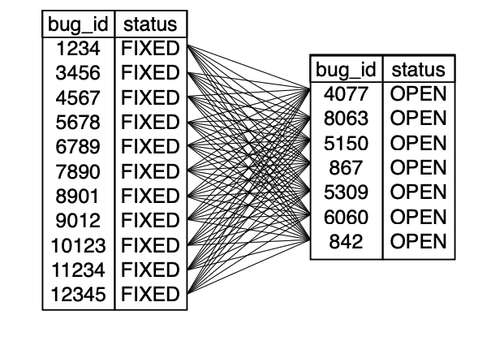

# Chapter 18 Spaghetti Query (스파게티 쿼리)

## 목표 - 쿼리 사이즈 줄이기
많은 개발자들이 쿼리를 작성하면서 가장 많이 고민하는 부분을 꼽자면 "이걸 어떻게 한번의 쿼리로 뽑아내지?" 일 것이다. 개발자들은 기본적으로 SQL 쿼리 자체가 어렵고 복잡하며 자원 소모가 많은 작업으로 인식하고 있기 때문에 하나로 해결 할 수 있는 일을 두개 이상의 쿼리를 실행하는 것은 두배로 나쁜 일이라고 인식한다. 한마디로 한번 이상의 SQL 쿼리로 문제를 해결하는 것 자체를 염두에 두지 않는다는 것이다.

개발자들이 해당 작업의 복잡도를 낮출 수는 없지만 간단하게 해결하려는 경향이 있다. 목표는 항상 "아름다우면서도 효율적"으로 문제를 푸는 것으로 생각하기 때문에 대게 어려운 문제를 하나의 쿼리로 풀려고 한다.

## 안티패턴 - 복잡한 문제를 한번에 해결하기
SQL은 매우 자원소모가 심한 언어이다. 따라서 하나의 쿼리나 선언으로 해결하는 것이 좋다. 하지만 이 의미가 항상 한 문제를 한 줄의 코드로 풀어라는 의미는 아니다. 우리는 다른 언어를 사용해서 문제를 해결할때도 이런식으로 접근하지 않는다.

### 의도하지 않은 제곱
모든 결과를 한 쿼리로 뽑아내는 과정에서 발생하는 실수는 곱집합이 발생하는 것이다. 이는 두 테이블을 조인하여 합칠때 아무런 조건이 없는 경우 발생한다. 아래 예시를 실행시키면 이런 현상이 발생하는 것을 이해할 수 있다.
```sql
SELECT p.product_id,
  COUNT(f.bug_id) AS count_fixed,
  COUNT(o.bug_id) AS count_open
FROM BugsProducts p
LEFT OUTER JOIN Bugs f ON (p.bug_id = f.bug_id AND f.status = 'FIXED')
LEFT OUTER JOIN Bugs o ON (p.bug_id = o.bug_id AND o.status = 'OPEN')
WHERE p.product_id = 1
GROUP BY p.product_id;
```


위 예시에서는 12개의 수정된 버그와 7개의 해결하지 못한 버그가 있다는 것을 알수 있다. 하지만 쿼리 결과를 본다면 의도하지 않은 결과가 나온것을 알 수 있을 것이다.

|product_id|count_fixed|count_open|
|----------|-----------|----------|
|1         |84         |84        |

무슨 문제 때문에 이런 결과가 나오게 되었을까? 여기서 집계 결과가 84가 나온것은 12와 7의 곱의 결과인 것을 알 수 있다. 이 예시에서는 `Products` 테이블에 두가지 다른 상태의 `Bugs` 테이블을 병합하였다. 이 결과 두 테이블의 값이 곱해져서 반환되었다. 즉, 12개의 `fixed` 상태인 로우와 7개의 `open` 로우가 서로 참조하는 결과가 나온 것이다.

이런 현상은 `GROUP BY` 절을 사용하여 통합하면 임시 방편으로 제거 할 순 있다.

```sql
SELECT p.product_id, f.bug_id AS fixed, o.bug_id AS open
FROM BugsProducts p
JOIN Bugs f ON (p.bug_id = f.bug_id AND f.status = 'FIXED')
JOIN Bugs o ON (p.bug_id = o.bug_id AND o.status = 'OPEN')
WHERE p.product_id = 1;
```
이 쿼리의 문제점은 `BugsProducts` 테이블에서 병합을 할때 `fixed` 와 `open` 각 상태를 병합할 때 서로 참조하지 않도록 제한을 걸지 않은 것이다. 그렇기 때문에 각자의 상태를 참조하여 곱해진 값을 반환 하게 된다.

### 이게 충분치 않다고 생각 할 수도 있지만...
이외에도 여러가지 문제가 발생하여 부정확한 데이터를 가져올 수 있다. 우리는 복잡한 문제를 단 하나의 쿼리로 가져오는것이 매우 힘들고 설사 해당 쿼리가 동작하더라도 문제가 발생하면 디버깅 하기 매우 어렵다는 사실을 알아야 한다. 또한 당신의 상사나 다른팀에서 더욱 더 복잡한 보고서를 요구하게 된다면 쿼리 하나로 뽑아내려고 하는 노력은 생산성이 매우 떨어지는 작업이 된다. 당신의 시간은 당신 뿐만 아니라 당신의 프로젝트를 위해서라도 아껴야 한다.

물론 성능상의 문제도 가지고 있다. 위와 같이 곱해지는 양상이 보이는 쿼리 같은 경우에는 SQL엔진이 효율적으로 처리하는데 상당한 시간이 걸린다. 직관적인 쿼리를 여러번 실행하는 것이 오히려 성능상 더 좋을수도 있다.

## 어떻게 안티패턴을 구분하는가
* 쿼리의 합계와 집계가 의도한 값보다 훨씬 큰 값이 나온 경우. <br>
의도치 않은 테이블간 곱이 발생된 경우이다.
* 하나의 거대하고 복잡한 쿼리를 작업하는데 하루종일 시간을 보낸 경우.<br>
SQL 작성하는 것은 그렇게까지 어려운 일이 아니다. 이렇게 하루종일 씨름을 한 경우라면 접근 방식을 달리해야하는 신호이다.
* 작성된 쿼리가 너무 복잡해서 수정하기가 어려운 경우<br>
마찬가지로 스파게티 쿼리를 작성해뒀기 때문에 다른 사람이 작업하기 어려워진다.
* 한 쿼리의 실행시간이 너무 느린 경우<br>
스파게티 쿼리는 높은 확률로 성능상의 문제를 일으킨다. 리팩토링이 필요한 시점이다.

## 안티패턴 사용이 정당화 되는 경우
보통 안티패턴이 필요한 이유는 프레임워크를 사용하거나 특정 컴포넌트 라이브러리를 사용하여 데이터를 보여주려고 하는 경우이다. 다시 말해 한번의 쿼리 실행으로 모든 데이터를 가져와서 리포트 형식으로 보여줘야 하는 경우이다. 이때 정렬 기능을 요구할 수도 있는데 이 경우 SQL 내부에서 `ORDER BY` 하는 것이 훨씬 간편하기 때문에 이런식으로 구현하는게 더 생산성이 좋을 수도 있다.

## 해결책 - 분할 정복하기
오컴의 윌리엄(William of Ockham)은 검약의 원리라는 말을 하였는데 내용은 다음과 같다.
> ### 검약의 원리(The Law of Parsimony) 또는 오컴의 면도날(Occam's razor)
> 동일한 예측을 하는 두가지 논리 중에서 고민한다면 간단한 쪽이 훨씬 낫다.

이 말은 동일한 결과를 가져오는 두가지 쿼리 중에서 고민한다면 간단한 쪽을 선택해라는 의미이다.

### 한번에 하나만
두 테이블을 병합할 때 곱집합과 같은 현상이 발생하지 않았다면 이는 단순히 그런 조건이 아닌 경우다. 곱집합을 피하기 위해선 하나의 쿼리를 여러개로 분리하는 것이 좋다.

```sql
SELECT p.product_id, COUNT(f.bug_id) AS count_fixed
FROM BugsProducts p
LEFT OUTER JOIN Bugs f ON (p.bug_id = f.bug_id AND f.status = 'FIXED')
WHERE p.product_id = 1
GROUP BY p.product_id;

SELECT p.product_id, COUNT(o.bug_id) AS count_open
FROM BugsProducts p
LEFT OUTER JOIN Bugs o ON (p.bug_id = o.bug_id AND o.status = 'OPEN')
WHERE p.product_id = 1
GROUP BY p.product_id;
```

위 쿼리의 집계 결과는 우리가 예상한 대로 12개의 `fixed` 로우와 7개의 `open` 로우를 반환한다.

> 이 글은 [SQL Antipatterns - by Bill Karwin](https://pragprog.com/titles/bksqla/sql-antipatterns/) 영문 원본의 Chapter18 를 요약한 글입니다. 자의적인 해석이 들어 간 것을 참고하셨으면 좋겠습니다.
