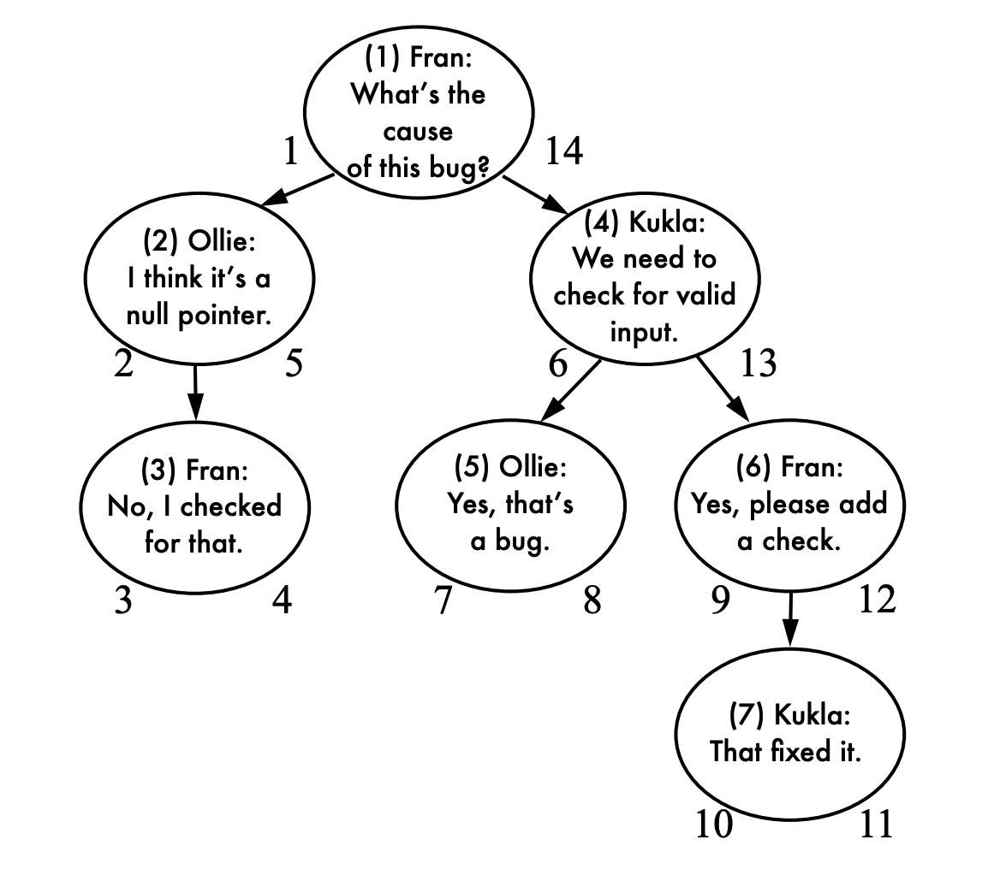
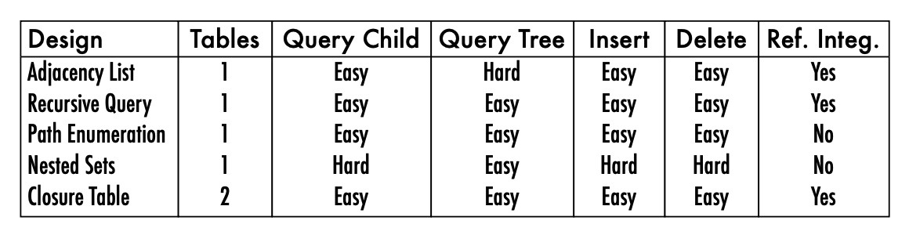

## Chapter 3 Naive Tree

### 인접 리스트(Adjacency list)

관계형 데이터베이스 모델링을 하는 경우 종종 인접리스트를 활용하여 코멘트 기능 같은 것들을 구현하는 경우가 있다. 경우에 따라 다르지만, 확장성과 사용성, 그리고 DB 브랜드 까지 충분한 고려를 하지 않으면 이는 안티패턴이 될 가능성이 있다. 아래 예시는 코멘트 기능을 간단하게 구현한 테이블이다.

```sql
CREATE TABLE Comments (
    comment_id SERIAL PRIMARY KEY,
    parent_id BIGINT UNSIGNED,
    bug_id BIGINT UNSIGNED NOT NULL,
    author BIGINT UNSIGNED NOT NULL,
    comment_date DATETIME NOT NULL,
    comment TEXT NOT NULL,
    FOREIGN KEY (parent_id) REFERENCES Comments(comment_id),
    FOREIGN KEY (bug_id) REFERENCES Bugs(bug_id),
    FOREIGN KEY (author) REFERENCES Accounts(account_id)
);
```

위 예시와 같이 인접리스트 형태는 자기참조를 하는 형식으로 코멘트 간의 부모 자식 노드를 구분한다. 이 경우 데이터 추가는 손쉽게 단일 테이블에 부모 노드의 ID만 명시하면 되기 때문에 간단하다.

```sql
INSERT INTO Comments (bug_id, parent_id, author, comment)
    VALUES (1234, 7, 'Kukla', 'Thanks!');
```

문제는 해당 테이블을 조회 또는 삭제할 때 발생한다. 우선 조회 할때는 바로 윗 노드에 해당되는 부모만 데이터로 가지고 있기 때문에 한 글의 모든 코멘트나 특정 깊이의 코멘트만 선택하여 가져오는것이 쉽지 않다.

```sql
# 조회 쿼리
SELECT c1.*, c2.*, c3.*, c4.*
FROM Comments c1 -- 1st level
    LEFT OUTER JOIN Comments c2
        ON c2.parent_id = c1.comment_id -- 2nd level
            LEFT OUTER JOIN Comments c3
                ON c3.parent_id = c2.comment_id -- 3rd level
                    LEFT OUTER JOIN Comments c4
                        ON c4.parent_id = c3.comment_id; -- 4th level
```

```sql
# 삭제 쿼리
SELECT comment_id FROM Comments WHERE parent_id = 4; -- returns 5 and 6
SELECT comment_id FROM Comments WHERE parent_id = 5; -- returns none
SELECT comment_id FROM Comments WHERE parent_id = 6; -- returns 7
SELECT comment_id FROM Comments WHERE parent_id = 7; -- returns none
DELETE FROM Comments WHERE comment_id IN ( 7 );
DELETE FROM Comments WHERE comment_id IN ( 5, 6 );
DELETE FROM Comments WHERE comment_id = 4;
```
위 처럼 일일이 부모 노드를 찾아가는 방식의 조회나 삭제를 실행해야만 한다. 물론 삭제의 경우 `DELETE CASCADE` 옵션을 활용하면 부모가 삭제될 때 자식 노드도 삭제 할 순 있지만, 이런 방식의 물리 삭제 방식(Hard delete)이 아닌 논리 삭제 방식(Soft delete)을 해야한다면 삭제 쿼리는 조회 쿼리만큼 복잡해진다.

### 자기참조 형식의 인접리스트가 무조건 안좋은 것일까?
자료구조와 마찬가지로 데이터 모델링에서도 무조건 안좋은 모델은 없다. 자기 참조 방식도 아래의 사전 조건들을 확인한다면 얼마든지 유용하게 쓸수 있다.

1. 데이터의 깊이가 어느정도 예상되는가?<br>
기본적으로 데이터의 관계 깊이가 2 단계 정도 얕은 수준으로 예측된다면 충분히 활용해 볼 수 있다. 자기 참조 형식이 개발 공수를 줄이는 적정 기술이 될 수 있다.
2. 재귀 쿼리를 지원해주는 DB를 사용하고 있는가? 그리고 충분히 잘 활용할 수 있는가?<br>
MySQL 5.x 이하 버진이나 SQLite 사용 하는것이 아니라면 재귀 쿼리를 통해 데이터를 조회 할 수 있다.
    ```sql
    WITH CommentTree
        (comment_id, bug_id, parent_id, author, comment, depth)
    AS (
        SELECT *, 0 AS depth FROM Comments
        WHERE parent_id IS NULL
        UNION ALL
            SELECT c.*, ct.depth+1 AS depth FROM CommentTree ct
            JOIN Comments c ON (ct.comment_id = c.parent_id)
    )
    SELECT * FROM CommentTree WHERE bug_id = 1234;
    ```
    위 예시처럼 `WITH ~ AS` 문을 활용하면 임시 테이블을 선언해서 사용한다면 어느정도 가독성을 고려한 쿼리를 작성할 수 있다.

3. 다른 데이터 저장소로 마이그레이션 하지 않는 단순 데이터인가?<br>
데이터 정제가 필요없다면 굳이 오버엔지니어링 할 필요없이 자기참조를 사용해도 괜찮다.

### 위 경우에 해당되지 않는다면 어떤 방법을 사용하는 것이 좋을까?

자기참조를 하지 않는 방식을 원한다면 결국 인접리스트와 유사하나 다른 형식의 모델링을 해야한다. 이 책에서는 3가지 모델링을 제안하고 있다.

### 경로 열거 구조(Path Enumeration)
인접리스트 형태의 단점 중 하나는 데이터를 조회하는데 많은 자원을 소모한다는 것이다. 이에 대한 노드 경로를 명시적으로 열거한 방식이 바로 경로 열거 형태의 테이블이다. 

```sql
CREATE TABLE Comments (
    comment_id SERIAL PRIMARY KEY,
    path VARCHAR(1000),
    bug_id BIGINT UNSIGNED NOT NULL,
    author BIGINT UNSIGNED NOT NULL,
    comment_date DATETIME NOT NULL,
    comment TEXT NOT NULL,
    FOREIGN KEY (bug_id) REFERENCES Bugs(bug_id),
    FOREIGN KEY (author) REFERENCES Accounts(account_id)
);
```


이러한 형태로 경로를 가지고 있게 된다면, 경로에 해당되는 모든 열, 원하는 깊이의 열만 조회 하거나 수정 하는 작업이 훨씬 간결해진다.

```sql

SELECT *
FROM Comments AS c
WHERE '1/4/6/7/' LIKE c.path || '%';

# 2번째 깊이 이상의 코멘트만 조회
SELECT *
FROM Comments AS c
WHERE c.path LIKE '1/4/' || '%';

# 2번째 깊이 이상의 코멘트 통계
SELECT COUNT(*)
FROM Comments AS c
WHERE c.path LIKE '1/4/' || '%'
GROUP BY c.author;
```
데이터를 추가 하는 경우에도 경로만 잘 저장하면 되기 때문에 크게 어렵지 않다. MySQL을 사용한다면 `LAST_INSERT_ID` 함수를 사용해서 자신의 ID를 추가 할수 있다.

```sql
INSERT INTO Comments (author, comment) VALUES ('Ollie', 'Good job!');
UPDATE Comments
  SET path = (SELECT path FROM Comments WHERE comment_id = 7)
    || LAST_INSERT_ID() || '/'
WHERE comment_id = LAST_INSERT_ID();
```

**단점**
[2장 Jaywalk](sql/SQL-Antipatterns-2.md)에서 언급했듯이 id 값들을 `VARCHAR`로 저장하는 방식은 어떠한 형식의 문자열도 들어 올수 있고 길이의 제한이 생길수도 있는 방법이라서 이를 검증하거나 방어하는 코드 로직들이 반드시 필요하다. 확장성 면에서 인접리스트와 마찬가지로 떨어지는 면이 있다.

### 중첩 집합 모델(Nested Sets)

이 구조는 각 부모노드가 자식노드를 직접 가지는 것이 아니라 자식노드의 집합을 특정 조건을 구성하여 가져가는 형태. 예제에서는 `nsleft`, `nsright` 를 사용하였다. 


```sql
CREATE TABLE Comments (
    comment_id SERIAL PRIMARY KEY,
    nsleft INTEGER NOT NULL,
    nsright INTEGER NOT NULL,
    bug_id BIGINT UNSIGNED NOT NULL,
    author BIGINT UNSIGNED NOT NULL,
    comment_date DATETIME NOT NULL,
    comment TEXT NOT NULL,
    FOREIGN KEY (bug_id) REFERENCES Bugs (bug_id),
    FOREIGN KEY (author) REFERENCES Accounts(account_id)
);
```

여기서 `nsleft`는 모든 자식노드 숫자보다 작은 조건을, `nsright`는 모든 자식노드의 자식노드 보다 크다는 조건을 가진다. 이 숫자는 테이블에서 생성되는 `id` 값과 전혀 연관이 없다. 이 조건을 통해 직접적으로 부모 자식 관계를 생성하는 것이 아니라 집합으로 구분 할 수 있게 한다.



```sql
SELECT c2.*
FROM Comments AS c1
  JOIN Comments as c2
    ON c2.nsleft BETWEEN c1.nsleft AND c1.nsright
WHERE c1.comment_id = 4;
```

중첩 집합 모델의 가장 큰 장점은 자식이 있는 노드를 삭제하더라도 해당 자식 노드들이 바로 상위 부모를 바라보게 된다는 점이다. `nsleft` 와 `nsright` 값 또한 그 상위 부모노드의 규칙을 따르기 때문에 문제가 없다.

```sql
-- Reports depth = 3
SELECT c1.comment_id, COUNT(c2.comment_id) AS depth
FROM Comment AS c1
    JOIN Comment AS c2
      ON c1.nsleft BETWEEN c2.nsleft AND c2.nsright
WHERE c1.comment_id = 7
GROUP BY c1.comment_id;

DELETE FROM Comment WHERE comment_id = 6;

-- Reports depth = 2
SELECT c1.comment_id, COUNT(c2.comment_id) AS depth
FROM Comment AS c1
    JOIN Comment AS c2
      ON c1.nsleft BETWEEN c2.nsleft AND c2.nsright
WHERE c1.comment_id = 7
GROUP BY c1.comment_id;
```

**단점**
가장 큰 문제점은 선택한 노드의 인접한 부모, 자식 노드들을 한꺼번에 불러올때 복잡한 쿼리를 작성해야 한다.

```sql
# id 6 번 코멘트의 인접 부모노드를 불러오는 경우
SELECT parent.*
FROM Comment AS c
    JOIN Comment AS parent
      ON c.nsleft BETWEEN parent.nsleft AND parent.nsright
    LEFT OUTER JOIN Comment AS in_between
      ON c.nsleft BETWEEN in_between.nsleft AND in_between.nsright
      AND in_between.nsleft BETWEEN parent.nsleft AND parent.nsright
WHERE c.comment_id = 6
  AND in_between.comment_id IS NULL;
```

노드 추가, 변경 및 이동을 할때도 복잡한 연산을 해야하는 쿼리를 작성해야한다. 특히 추가하는 경우 루트에서 지정한 `nsleft`, `nsright` 값을 기반으로 순차적으로 다시 계산을 해야하므로 자원 소모가 심하다.

따라서 집합 계층 구조를 사용하고자 한다면, 간단한 서브트리 형태가 필요한 경우에만 사용하는 것을 권장한다.


### 클로저 테이블(Closure Table)
필자가 보기에 가장 심플한 구조로써, 자기참조를 중계 테이블을 추가하여 관리하는 것이다. 이런 방식으로 하면 각 노드가 서로 직접 연결될수도, 계층을 통해 연결될 수도 있다. 이는 좀 더 유연한 데이터 구조를 가지게 된다.

```sql
CREATE TABLE Comments (
    comment_id SERIAL PRIMARY KEY,
    bug_id BIGINT UNSIGNED NOT NULL,
    author BIGINT UNSIGNED NOT NULL,
    comment_date DATETIME NOT NULL,
    comment TEXT NOT NULL,
    FOREIGN KEY (bug_id) REFERENCES Bugs(bug_id),
    FOREIGN KEY (author) REFERENCES Accounts(account_id)
);
CREATE TABLE TreePaths (
    ancestor BIGINT UNSIGNED NOT NULL,
    descendant BIGINT UNSIGNED NOT NULL,
    PRIMARY KEY(ancestor, descendant),
    FOREIGN KEY (ancestor) REFERENCES Comments(comment_id),
    FOREIGN KEY (descendant) REFERENCES Comments(comment_id)
);
```

조회, 추가 쿼리도 좀 더 직관적이다.

```sql

# 부모가 4인 코멘트 조호ㅢ
SELECT c.*
FROM Comments AS c
    JOIN TreePaths AS t ON c.comment_id = t.descendant
WHERE t.ancestor = 4;

# 자식이 6인 코멘트 조회
SELECT c.*
FROM Comments AS c
    JOIN TreePaths AS t ON c.comment_id = t.ancestor
WHERE t.descendant = 6;

# 코멘트 추가
INSERT INTO TreePaths (ancestor, descendant)
    SELECT t.ancestor, 8
    FROM TreePaths AS t
    WHERE t.descendant = 5
UNION ALL
    SELECT 8, 8;

# 자식이 7인 코멘트 모두 삭제
DELETE FROM TreePaths WHERE descendant = 7;

# 부모가 4인 코멘트 모두 삭제
DELETE FROM TreePaths
WHERE descendant IN (SELECT descendant
                      FROM TreePaths
                      WHERE ancestor = 4);

```

삭제에서 눈여겨 봐야 할 점은 코멘트를 직접 삭제하는 것이 아니라 `TreePaths` 테이블에 있는 관계를 삭제한다는 것이다. 물리적 삭제가 반드시 필요하다면 관계 삭제 후, 코멘트 테이블에서 직접 삭제를 차후에 따로 실행하는 방식으로 진행하면 된다.




### 결론
이 장에서 다룬 모든 전략이 다 저마다 상황에 따라 가치가 있다고 생각한다. 마지막에 소개한 클로저 테이블이 가장 확장성과 안정성 모두 추구한 모델링 전략이라고 생각하지만 다른 전략과는 다르게 중계 테이블을 생성해야 한다는 점, 계층 관계가 깊어지면 깊어질수록 인접 리스트 형식처럼 쿼리 자원 소모값이 늘어난다는 단점도 있다. 각 상황에 맞추어 이에 맞는 전략을 가져가는 것이 가장 중요하다고 볼 수 있다.

> 이 글은 [SQL Antipatterns - by Bill Karwin](https://pragprog.com/titles/bksqla/sql-antipatterns/) 영문 원본의 Chapter3 를 요약한 글입니다. 자의적인 해석이 들어 간 것을 참고하셨으면 좋겠습니다.
> 