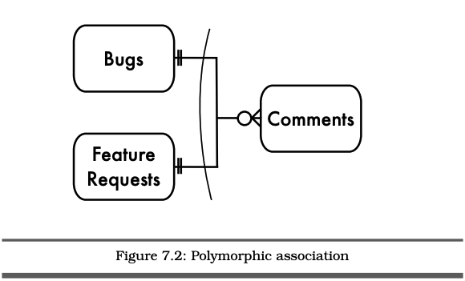
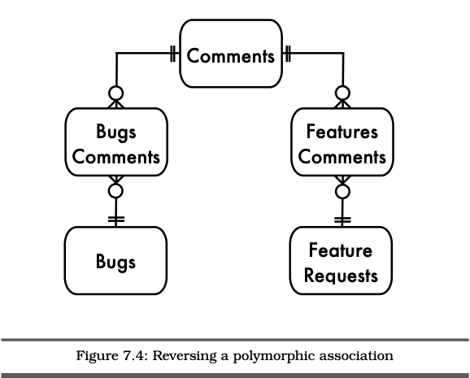
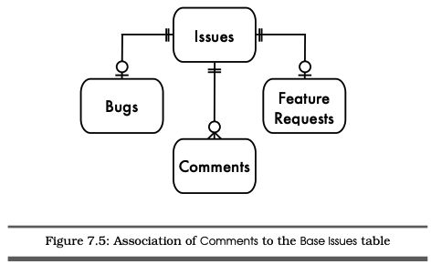

# Chapter 7 Polymorphic Associations (다형성 관계 테이블)

아래의 DDL 처럼 한 컬럼에 두개의 테이블을 동시에 참조하는 방식은 SQL에서 지원하지 않는다.

```sql
CREATE TABLE Comments (
  comment_id SERIAL PRIMARY KEY,
  bug_id BIGINT UNSIGNED NOT NULL,
  author_id BIGINT UNSIGNED NOT NULL,
  comment_date DATETIME NOT NULL,
  comment TEXT NOT NULL,
  FOREIGN KEY (author_id) REFERENCES Accounts(account_id),
  FOREIGN KEY (bug_id) REFERENCES Bugs(bug_id)
  FOREIGN KEY (issue_id) REFERENCES Bugs(issue_id) OR FeatureRequests(issue_id)
);
```

## 목표 - 여러 부모 테이블 참조하기

```sql
CREATE TABLE Comments (
  comment_id SERIAL PRIMARY KEY,
  issue_type VARCHAR(20), -- "Bugs" or "FeatureRequests"
  issue_id BIGINT UNSIGNED NOT NULL,
  author BIGINT UNSIGNED NOT NULL,
  comment_date DATETIME,
  comment TEXT,
  FOREIGN KEY (author) REFERENCES Accounts(account_id)
);
```

위 예시는 `Comments` 테이블의 `issue_type`에 따라 `Bugs` 테이블을 참조할 것인지 `FeatureRequests` 테이블을 참조할 것인지 지정하는 것을 목표로 한다. 이러한 관계를 다형성 관계라고 칭한다.




## 안티패턴 - 이중목적 외래키 사용
다형성 관계를 만들기 위해선 `issue_id`라는 컬럼을 추가해야한다. 이 컬럼의 값은 예시에서 언급된 `Bugs` 또는 `FeatureRequests` 중 어느 테이블을 참조 할 것인지 결정한다. 여기서 문제점은 `issue_id`에 외래키 선언이 빠져있다는 점이다. 앞선 쳅터에서 설명했듯이 외래키 제약조건은 반드시 다른 테이블을 지정해서 참조해야하기 때문에 참조 무결성을 보장하지 못한다.

### 다형성 관계 테이블 조회하기
`Comments` 테이블을 `issue_id`와 `issue_type`에 따라 구분되고 있기 때문에 각기 다른 부모 테이블의 코멘트를 조회하려면 `issue_type`에 부여한 값을 정확하게 지정하고 조회해야만 한다.

```sql
SELECT *
FROM Bugs AS b JOIN Comments AS c
  ON (b.issue_id = c.issue_id AND c.issue_type = 'Bugs')
WHERE b.issue_id = 1234;
```

위 코드가 잘 동작하는것 처럼 보이지만 `Bugs` 테이블과 `FeatureRequests` 테이블을 함께 조회하려는 경우 문제가 발생한다.

```sql
SELECT *
FROM Comments AS c
  LEFT OUTER JOIN Bugs AS b
    ON (b.issue_id = c.issue_id AND c.issue_type = 'Bugs')
  LEFT OUTER JOIN FeatureRequests AS f
    ON (f.issue_id = c.issue_id AND c.issue_type = 'FeatureRequests');
```

위 쿼리의 결과값은 다음과 같다.

|c.comment_id|c.issue_type|c.issue_id|c.comment|b.issue_id|f.issue_id|
|------------|------------|----------|---------|----------|----------|
|6789|Bugs|1234|It crashes!|1234|NULL|
|9876|Feature...|2345|Great idea!|NULL|2345|

위처럼 컬럼을 추가하여 결과값을 도출해야하는데 보다시피 매칭되지않는 로우 데이터는 `NULL`을 반환하고 있다.


### 객체지향 스타일이 아닌 경우
이 예제에서 `Bugs`와 `FeatureRequests` 테이블 모두 모델과 연관된 서브타입이다. 다형성 관계 모델은 각 부모 테이블이 완전히 관계가 없는 경우 사용될 수도 있다. 예를 들어 이커머스 데이터베이스에서는 `Users` 테이블과 `Orders` 테이블이 `Addresses` 테이블과 관계를 형성하고 있다.

```sql
CREATE TABLE Addresses (
  address_id SERIAL PRIMARY KEY,
  parent VARCHAR(20), -- "Users" or "Orders"
  parent_id BIGINT UNSIGNED NOT NULL,
  address TEXT
);
```

이런 경우 `Addresses` 테이블은 다형성 관계를 가지고 있다. 여기에 `Billings` 와 `Shippings` 에 대한 다형성 관계 또한 추가하게 된다면 아래와 같은 모습이 될 것이다.

```sql
CREATE TABLE Addresses (
  address_id SERIAL PRIMARY KEY,
  parent VARCHAR(20), -- "Users" or "Orders"
  parent_id BIGINT UNSIGNED NOT NULL,
  users_usage VARCHAR(20), -- "billing" or "shipping"
  orders_usage VARCHAR(20), -- "billing" or "shipping"
  address TEXT
);
```
이런 경우 `Addresses` 테이블의 복잡도가 한없이 높아지게 된다.

## 어떻게 안티패턴을 구분하는가
아래와 같은 이야기를 들은적이 있다면, 안티패턴을 적용하고 있다는 증거이다.
* 이 태깅 스키마 방식은 데이터베이스에 존재하는 모든 요소를 태깅 함으로써 관계를 지을 수 있다.<br>
바로 이전 쳅터에서 언급했던 EAV 방식처럼 무제한적인 유연성을 보장한다는 의미는 안티패턴일 가능성이 높음.
* 외래키 제약조건을 선언할 수 없는 경우<br>
외래키 제약조건은 관계형 데이터베이스의 핵심이다. 이 조건을 사용 할 수 없다는건 참조 무결성을 보장 할 수 없다는 것과 동일하다.
* `entity_type` 컬럼이 무슨의미를 가지고 있는지 직관적으로 이해하기 힘든 경우<br>
외래키 제약조건은 항상 동일한 테이블을 가리키고 있어야 한다.

루비 온 레일즈나 자바의 Hibernate 프레임워크 같은 경우 프레임워크 자체에서 다형성 관계 모델을 지원한다. 이런 경우 프레임워크에서 지원하는 대로만 사용해야 하는 문제가 발생한다.

```rb
class Comment < ActiveRecord::Base
  belongs_to :commentable, :polymorphic => true
end

class Bug < ActiveRecord::Base
  has_many :comments, :as => :commentable
end

class FeatureRequest < ActiveRecord::Base
  has_many :comments, :as => :commentable
end
```

## 안티패턴이 허용되는 경우
다형성 관계 모델이 허용되는 경우는 없다. 이러한 모델링은 어플리케이션 코드에 전적으로 의존하고 관리되기 때문이다. 앞서 언급했듯이 특정 프레임워크에서 다형성 관계 모델을 지원하기 때문에 사용하는 경우 반드시 프레임워크 규칙을 잘 따라야한다. 그렇지 않고 직접 해당 기능을 설계하는 경우 차라리 하지않는 것이 낫다.

## 해결책 - 관계 단순화 하기
다형성 관계를 고려하는 것 보다 데이터베이스 설계를 다시 하는 것이 올바른 선택지이다. 아래 대안중 하나를 선택하여 적용 할 수 있다.

### 역참조 설계
잘 생각해보면 다형성 관계가 필요한 설계는 해당 관계를 역참조 함으로써 해결할 수 있다.

### 역참조 중계 테이블 생성
자식 테이블은 여러 부모 테이블을 참조 할 수 없다. 하지만 부모 테이블은 여러 자식 테이블을 가질 수 있다. 따라서 논리적으로 검토 해 본다면 역참조 설계가 옳다는 것을 바로 눈치 챌 수 있다.

```sql
CREATE TABLE BugsComments (
  issue_id BIGINT UNSIGNED NOT NULL,
  comment_id BIGINT UNSIGNED NOT NULL,
  PRIMARY KEY (issue_id, comment_id),
  FOREIGN KEY (issue_id) REFERENCES Bugs(issue_id),
  FOREIGN KEY (comment_id) REFERENCES Comments(comment_id)
);

CREATE TABLE FeaturesComments (
  issue_id BIGINT UNSIGNED NOT NULL,
  comment_id BIGINT UNSIGNED NOT NULL,
  PRIMARY KEY (issue_id, comment_id),
  FOREIGN KEY (issue_id) REFERENCES FeatureRequests(issue_id),
  FOREIGN KEY (comment_id) REFERENCES Comments(comment_id)
);
```



위와 같이 설계를 한다면 `issue_type` 컬럼 또한 필요가 없다. 또한 제약 조건 메타데이터를 생성함으로써 데이터 정합성 또한 보장된다.

### 신호등 뽑아버리기
중계 테이블은 보통 다대다 관계를 설계하기 위해 사용되기 때문에 하나의 `Comments` 로우가 하나의 `Bugs` 나 `FeatureRequests`를 참조하는것이 아니라 여러 `Bugs`나 `FeatureRequests`를 참조하게 된다. 이런 관계가 아니라 일대다 관계를 원한다면 `unique` 옵션을 `comment_id`에 선언 하면 가능하다.

```sql
CREATE TABLE BugsComments (
  issue_id BIGINT UNSIGNED NOT NULL,
  comment_id BIGINT UNSIGNED NOT NULL,
  UNIQUE KEY (comment_id),
  PRIMARY KEY (issue_id, comment_id),
  FOREIGN KEY (issue_id) REFERENCES Bugs(issue_id),
  FOREIGN KEY (comment_id) REFERENCES Comments(comment_id)
);
```
이 방식은 중계테이블에서 여러 `Comments` 로우가 참조되는 현상을 방지 할 수 있다.

### 참조 테이블 함께 조회하기
`BugsComments` 테이블만 조회한다고 했을 경우 아래와 같이 중계테이블을 조인하여 쿼리를 실행하면 된다.
```sql
SELECT *
FROM BugsComments AS b
  JOIN Comments AS c USING (comment_id)
WHERE b.issue_id = 1234;
```

만일 `BugsComments`와 `FeatureComments` 모두 조회하고 싶다면, `LEFT OUTER JOIN`을 이용하여 아래와 같이 조회하면 된다.

```sql
SELECT *
  FROM Comments AS c
    LEFT OUTER JOIN (BugsComments JOIN Bugs AS b USING (issue_id))
      USING (comment_id)
    LEFT OUTER JOIN (FeaturesComments JOIN FeatureRequests AS f USING (issue_id))
      USING (comment_id)
    WHERE c.comment_id = 9876;
```
이 방법은 다형성 관계 테이블을 조회할 때보다 훨씬 직관적이고 깔끔하다.

### 경로 단일화
종종 하나의 부모 테이블서 서로 다른 자식 테이블의 데이터를 하나로 합쳐서 조회해야 하는 경우가 있다. 이런 경우 두가지 방법이 있다.

#### `UNION` 사용하기
`UNION`을 사용하여 서로 다른 두 쿼리를 하나로 합쳐 조회할 수 있다.
```sql
  SELECT b.issue_id, b.description, b.reporter, b.priority, b.status,
    b.severity, b.version_affected, NULL AS sponsor
  FROM Comments AS c
    JOIN (BugsComments JOIN Bugs AS b USING (issue_id))
      USING (comment_id)
  WHERE c.comment_id = 9876;
UNION
  SELECT f.issue_id, f.description, f.reporter, f.priority, f.status,
    NULL AS severity, NULL AS version_affected, f.sponsor
  FROM Comments AS c
    JOIN (FeaturesComments JOIN FeatureRequests AS f USING (issue_id))
      USING (comment_id)
  WHERE c.comment_id = 9876;
```
이 방법은 하나의 부모 테이블에서 두가지 다른 자식테이블의 정보를 참조하여 하나의 뷰를 생성하는 방법이다. 또 다른 방법은 `COALSECE()` 함수를 사용하는 방법이다. 이 함수는 `NULL`이 아닌 첫번째 인자값을 리턴하는 함수이다. `OUTER JOIN`을 함으로써 없는 로우 값을 `NULL`로 반환하는 것을 방지 할 수 있다.

```sql
SELECT c.*,
  COALESCE(b.issue_id, f.issue_id ) AS issue_id,
  COALESCE(b.description, f.description) AS description,
  COALESCE(b.reporter, f.reporter ) AS reporter,
  COALESCE(b.priority, f.priority ) AS priority,
  COALESCE(b.status, f.status ) AS status,
  b.severity,
  b.version_affected,
  f.sponsor
FROM Comments AS c
  LEFT OUTER JOIN (BugsComments JOIN Bugs AS b USING (issue_id))
    USING (comment_id)
  LEFT OUTER JOIN (FeaturesComments JOIN FeatureRequests AS f USING (issue_id))
    USING (comment_id)
WHERE c.comment_id = 9876;
```
위 두가지 방법 모드 꽤나 복잡한 쿼리이기 때문에 데이터베이스 내부에 뷰로 생성해두면 좋다.

### 슈퍼 테이블 생성하기
객체지향적 다형성 이론에서는 두가지 서브타입들이 비슷하게 참조 될 수 있다고 언급한다. 그 이유는 해당 서브타입들 모두 하나의 슈퍼타입을 공유하고 있기 때문이다. 따라서 다형성 관계 모델링을 역참조 하는 방식으로 하나의 슈퍼 테이블을 공유하여 확장성을 보장 할 수 있다.



```sql
CREATE TABLE Issues (
  issue_id SERIAL PRIMARY KEY
);

CREATE TABLE Bugs (
  issue_id BIGINT UNSIGNED PRIMARY KEY,
  FOREIGN KEY (issue_id) REFERENCES Issues(issue_id),
. . .
);

CREATE TABLE FeatureRequests (
  issue_id BIGINT UNSIGNED PRIMARY KEY,
  FOREIGN KEY (issue_id) REFERENCES Issues(issue_id),
. . .
);

CREATE TABLE Comments (
  comment_id SERIAL PRIMARY KEY,
  issue_id BIGINT UNSIGNED NOT NULL,
  author BIGINT UNSIGNED NOT NULL,
  comment_date DATETIME,
  comment TEXT,
  FOREIGN KEY (issue_id) REFERENCES Issues(issue_id),
  FOREIGN KEY (author) REFERENCES Accounts(account_id),
);
```

여기서 주의해야 할 점은 `Bugs`와 `FeatureRequests` 또한 외래키로 맺어져 있다는 것이다. 그리고 두 테이블 모두 `Issues` 슈퍼테이블의 `id` 값을 상속받아 일대일 관계를 형성하고 있다. 즉 `Bugs` 테이블과 `FeaturesRequests` 모두 `Issues`에서 생성된 고유키를 통해 한꺼번에 조회가 가능하다.

```sql
SELECT *
FROM Comments AS c
  LEFT OUTER JOIN Bugs AS b USING (issue_id)
  LEFT OUTER JOIN FeatureRequests AS f USING (issue_id)
WHERE c.comment_id = 9876;

SELECT *
FROM Bugs AS b
  JOIN Comments AS c USING (issue_id)
WHERE b.issue_id = 1234;
```

이 방식은 슈퍼테이블에서 생성하는 고유키로 서브테이블의 참조 정합성을 보장하는 방식이다.

> 이 글은 [SQL Antipatterns - by Bill Karwin](https://pragprog.com/titles/bksqla/sql-antipatterns/) 영문 원본의 Chapter7 를 요약한 글입니다. 자의적인 해석이 들어 간 것을 참고하셨으면 좋겠습니다.
