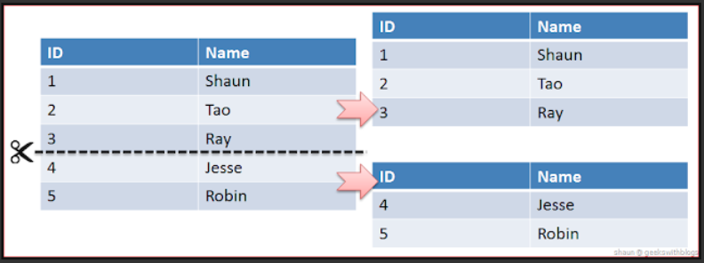

# Chapter 9 Metadata Tribbles (메타데이터 트리블)

## 목표 - 확장성 보장하기
어떤 데이터베이스를 사용하더라도 데이터 양이 많아지면 쿼리의 성능이 저하되기 마련이다. 원하는 쿼리의 결과값이 수천개의 로우만 반환 하더라도 테이블의 크기가 커질수록 일어나는 자연스러운 현상이다. 테이블 인덱싱을 통해 조회 속도 향상을 기대 할 수 있지만, 데이터 크기가 문제는 여전히 남아있다. 이번 주제는 데이터 크기가 증가하더라도 균일한 쿼리 성능을 보장하는 데이터베이스 구조를 구축하는 것이다.

## 안티패턴 - 테이블 또는 컬럼 클론하기
적은 로우를 가진 테이블을 조회 할 때 쿼리 실행 속도가 더 빠르다는 사실은 SQL을 사용하는 개발자라면 익히 알고 있는 상식이다. 하지만 이런 상식이 때때로 아래 두가지 형태의 잘못된 모델링을 설계하는 원인이 되기도 한다.
* 하나의 테이블을 비슷한 이름을 가진 여러 작은 테이블로 분할 하여 관리.
* 하나의 컬럼에 속한 데이터를 비슷한 이름을 가진 여러 작은 컬럼으로 분리하여 관리.

하지만 이러한 방식은 항상 하나의 결과를 취하기 위해 여러가지 문제를 발생시킨다. 

### 테이블 복제
데이터를 복제한 각각의 테이블에 분산 저장하기 위해서는 동일한 메타데이터를 가진 테이블을 특정 네이밍 규칙에 따라 생성해줘야한다. 아래의 예시는 `date_reported` 컬럼의 년도 정보에 따른 데이터 복제 생성 및 데이터 저장 DDL이다.

```sql
# 테이블 복제
CREATE TABLE Bugs_2008 ( . . . );
CREATE TABLE Bugs_2009 ( . . . );
CREATE TABLE Bugs_2010 ( . . . );

# 데이터 저장
INSERT INTO Bugs_2010 (..., date_reported, ...) VALUES (..., '2010-06-01', ...);
INSERT INTO Bugs_2011 (..., date_reported, ...) VALUES (..., '2011-02-20', ...);
```
위 처럼 `date_reported`의 년도 기준에 맞추어 각 해당되는 테이블에 데이터를 추가해야만 한다.

### 데이터 무결성 관리
실수로 `Bugs_2009` 테이블에 2010년도 데이터가 추가되면 어떻게 방지 할 수 있을까? 사실 이 방식에서는 제약 조건을 자동으로 선언 할 수 있는 방법은 없다. 다만 `CHECK` 제약조건을 아래 예시처럼 각 테이블에 선언 함으로써 무결성을 어느정도 보장 할 수 있다.

```sql
CREATE TABLE Bugs_2009 (
  -- other columns
  date_reported DATE CHECK (EXTRACT(YEAR FROM date_reported) = 2009)
);
CREATE TABLE Bugs_2010 (
  -- other columns
  date_reported DATE CHECK (EXTRACT(YEAR FROM date_reported) = 2010)
);
```

### 데이터 동기화
만약 2010년 1월 3일에 보고된 버그 데이터를 2009년 12월 27일로 변경해야 된다면 어떻게 해야될까? 이는 `Bugs_2010`에 등록된 데이터를 `Bugs_2009`에 등록하고 `Bugs_2010` 데이터를 삭제해야한다.
```sql
INSERT INTO Bugs_2009 (bug_id, date_reported, ...)
  SELECT bug_id, date_reported, ...
  FROM Bugs_2010
  WHERE bug_id = 1234;

# 삭제
DELETE FROM Bugs_2010 WHERE bug_id = 1234;
```
위와 같이 하지않고 `Bugs_2010`에 있는 로우 데이터의 일자를 단지 수정만 하게 된다면 테이블내 존재하는 데이터의 일관성을 잃게된다.

### 유일성 보장
이러한 형태의 테이블을 구성할 때 유의해야 할 점은 각 테이블의 고유키 값이 항상 유일해야 한다는 점이다. 이는 다시말해 고유키만 생성 및 저장하는 일대일 관계의 부모 테이블이 존재해야한다는 의미이다.

```sql
# 고유키 생성 테이블
CREATE TABLE BugsIdGenerator (bug_id SERIAL PRIMARY KEY);

INSERT INTO BugsIdGenerator (bug_id) VALUES (DEFAULT);
ROLLBACK;

INSERT INTO Bugs_2010 (bug_id, . . .)
  VALUES (LAST_INSERT_ID(), . . .);
```

### 테이블 통합 조회하기
현재까지 생성된 모든 버그를 상태별로 통계 내기 위해선 필연적으로 모든 테이블을 `UNION`을 사용하여 조회하여야 한다.

```sql
SELECT b.status, COUNT(*) AS count_per_status FROM (
  SELECT * FROM Bugs_2008
    UNION
  SELECT * FROM Bugs_2009
    UNION
  SELECT * FROM Bugs_2010 ) AS b
GROUP BY b.status;
```
이 방식은 년도가 바뀌면서 테이블이 생성될 때마다 지속적으로 추가 해줘야 한다.

### 메타데이터 동기화
만약 `Bugs` 테이블에 해당 버그를 해결하기 위해 소요된 시간을 기록하는 컬럼을 추가해야된다면 어떻게 해야할까? 간단하게는 가장 최근에 사용하고 있는 `Bugs_2010` 테이블에만 `hours`라는 컬럼을 추가하면 된다.

```sql
ALTER TABLE Bugs_2010 ADD COLUMN hours NUMERIC(9,2);
```
하지만 여기서 문제는 기존에 사용하고 있던 다른 테이블에서 나타난다. 현재 년도에 해당되는 테이블만 조회하거나 통계를 낼 때에는 문제가 없지만 만약 테이블 통합 조회를 해야한다면 `UNION`을 사용 할 수 없는 문제가 발생한다. 이런 경우 `*` 와일드 카드를 사용하는 것이 아니라 각 컬럼별로 일일히 컬럼을 선언하고 조회해야 한다.


### 참조 무결성 관리
`Bugs` 테이블을 참조하는 `Comments` 테이블을 생성 할 경우 아래와 같은 DDL은 성립하지 않는다. 외래키 제약조건은 여러번 언급했지만 반드시 하나의 테이블을 참조해야 한다.

```sql
CREATE TABLE Comments (
  comment_id SERIAL PRIMARY KEY,
  bug_id BIGINT UNSIGNED NOT NULL,
  FOREIGN KEY (bug_id) REFERENCES Bugs_????(bug_id)
);
```
분할된 테이블은 또한 부모 테이블을 참조할 때 아래와 같이 반드시 `UNION`을 사용해야지만 통합 조회가 가능하다.

```sql
SELECT * FROM Accounts a
JOIN (
  SELECT * FROM Bugs_2008
    UNION ALL
  SELECT * FROM Bugs_2009
    UNION ALL
  SELECT * FROM Bugs_2010
) t ON (a.account_id = t.reported_by)
```

### 메타데이터 트리블 컬럼 식별하기
테이블에 있는 컬럼 또한 메타데이터 트리블 형태가 될 수 있다. 아래 예시처럼 `ProjectHistory` 테이블에 각 년도별로 고친 버그 통계를 저장하는 것 처럼 말이다.
```sql
CREATE TABLE ProjectHistory (
  bugs_fixed_2008 INT,
  bugs_fixed_2009 INT,
  bugs_fixed_2010 INT
);
```
이 경우도 마찬가지로 매 해가 지남에 따라 새로운 컬럼을 지속적으로 생성해줘야 한다.

## 어떻게 안티패턴을 구분하는가
아래와 같은 말들을 하고 있다면 메타데이터 트리블 안티패턴을 사용하고 있는 증거이다.
* 특정 기준으로 하나씩 분할된 테이블을 생성<br>
  특정 기준으로 하나로 이루어져야 할 테이블을 분할 생성된다는 것은 메타데이터 트리블을 구사한다는 명확한 증거이다.
* 테이블을 최대 몇개까지 생성 가능한지 고민 하는 경우.<br>
  대부분의 DB는 개발자가 제품 개발할 때 필요한 테이블 갯수보다 훨씬 더 많은 테이블을 생성할 수 있도록 지원한다. 만약 테이블 생성 최대치를 넘기는 경우가 있다면 메타데이터 트리블 안티패턴을 구사하고 있는 경우가 확실하다.
* 해가 지나서 새로운 테이블을 생성하지 않아 어플리케이션에서 서버에러가 발생하는 경우.<br>
  메타데이터 트리블을 사용하는 경우 흔히 발생하는 에러이다.
* 동일한 컬럼을 가진 테이블들을 한번에 조회 하려는 경우<br>
  똑같은 메타데이터를 지닌 테이블들을 한번에 조회하려는 경우 또한 메타데이터 트리블의 단서이다.
* 테이블명을 인자값으로 넘기기 위해 고민하는 경우<br>

## 안티패턴 사용이 정당화 되는 경우
수동으로 테이블을 분리하는 것이 좋은 경우는 더 이상 서비스에 사용되지 않는 데이터를 보관하는 경우이다. 이 작업을 해주기만 해도 쿼리의 성능이 월등히 좋아진다. 만약 서비스에 사용되진 않으나 히스토리 용도로 필요한 데이터셋이 있다면 분리해서 보관하자.

## 해결책 - 파티션 및 정규화
테이블을 수동으로 분리하는 것 보다 더 좋은 방법은 수평 분할(또는 샤딩-sharding), 수직 분할 및 종속 테이블을 활용하는 방법이 있다.

### 수평 분할
수평 분할 또는 샤딩이라 불리는 이 기법은 말 그대로 테이블에 있는 로우들을 특정 규칙에 의해 수평 분할 하는 것이다.

수평 분할을 사용하면 기본적으로 하나의 테이블이 여러 파일로 나뉘어 저장된다. 하지만 우리가 쿼리를 실행하면 SQL 내부에서는 마치 하나의 테이블에 대한 쿼리를 실행 하는 것처럼 동작하게 된다. 이는 테이블의 무결성을 보장하면서도 수동으로 일일히 테이블을 생성하는 번거로움과 휴먼에러를 방지 할 수 있다. 아래 예시는 `date_reported`의 년도에 따라 4개의 파티션으로 수평 분할하는 DDL 이다.

```sql
CREATE TABLE Bugs (
  bug_id SERIAL PRIMARY KEY,
  -- other columns
  date_reported DATE
) PARTITION BY HASH ( YEAR(date_reported) )
  PARTITIONS 4;
```

파티셔닝은 SQL 표준으로 정립된 것이 없기 때문에 각 DB 브랜드 마다 서로 다른 방식으로 파티셔닝을 구현하고 있다. 그래도 여기서 핵심은 거의 모든 SQL 에서 파티셔닝을 지원한다는 점이다.

### 수직 분할
샤딩과 다르게 수직 분할은 컬럼 기준으로 데이터를 나눈다. 이 방식은 여러 컬럼 중 자주 사용되지 않거나 컬럼에 저장된 데이터가 아주 큰 경우 빛을 발한다. 예를 들어 `BLOB` 이나 `TEXT` 속성을 담고 있는 컬럼은 아주 큰 데이터를 저장하고 있을 것이다. 이를 효율적으로 관리하기 위해 `BLOB` 이나 `TEXT` 속성의 컬럼을 수직 분할하여 따로 저장하고 있으면 쿼리 성능을 향상 시킬 수 있다. 

예를 들어 `Bugs`라는 DB에 `Product`라는 테이블이 있고 이 테이블은 각 제품의 실행 파일을 담고 있다고 생각 해보자. Windows의 경우 `.exe` 파일을, MacOS의 경우 `.dmg` 파일을 테이블에 저장하고 있을 것이다. 이 설치 파일들은 엄청 크고 무겁기 때문에 하나의 테이블에 모두 저장하는 것이 아니라 일대일 관계를 맺어 수직 분할 하는것이 더욱 효율적일 것이다. 이런 경우 설치 파일이 필요한 경우만 따로 호출하여 결과를 내주면 되기 때문에 쿼리 성능상에도 이점을 가질수 있다.

```sql
CREATE TABLE Bugs (
  bug_id SERIAL PRIMARY KEY, -- fixed length data type
  summary CHAR(80), -- fixed length data type
  date_reported DATE, -- fixed length data type
  reported_by BIGINT UNSIGNED, -- fixed length data type
  FOREIGN KEY (reported_by) REFERENCES Accounts(account_id)
);

CREATE TABLE BugDescriptions (
  bug_id BIGINT UNSIGNED PRIMARY KEY,
  description VARCHAR(1000), -- variable length data type
  resolution VARCHAR(1000) -- variable length data type
  FOREIGN KEY (bug_id) REFERENCES Bugs(bug_id)
);
```

### 종속 테이블 생성하기
[이전 챕터](SQL-Antipatterns-8.md)에서 다루었듯이 메타데이터 트리블 안티패턴도 종속 테이블을 활용하여 해결 할 수도 있다.
```sql
CREATE TABLE ProjectHistory (
  project_id BIGINT,
  year SMALLINT,
  bugs_fixed INT,
  PRIMARY KEY (project_id, year),
  FOREIGN KEY (project_id) REFERENCES Projects(project_id)
);
```
위 DDL처럼 프로젝트당 여러 컬럼을 가지는 것 대신 일대다 관게를 맺어 줌으로써 해결 할 수도 있다. 어찌됐든 수동으로 비슷한 속성의 테이블을 여러번 생성하는 짓은 하지말자.

> 이 글은 [SQL Antipatterns - by Bill Karwin](https://pragprog.com/titles/bksqla/sql-antipatterns/) 영문 원본의 Chapter9 를 요약한 글입니다. 자의적인 해석이 들어 간 것을 참고하셨으면 좋겠습니다.
