# PostgreSQL 모니터링을 위한 핵심 지표

PostgreSQL, 또는 간단하게 "Postgres"라고 불리는 데이터베이스는 오픈소스 관계형 데이터베이스 시스템이다. 이 시스템은 버클리에 위치한 캘리포니아 주립대학교의 POSTGRES 프로젝트에서 탄생하게 되었다. PostgreSQL는 다중 버전 동시성 제어(MVCC, Multi-Version Concurrency Control)와 로그 선행 기입(WAL, Write-ahead logging)과 같은 빌트인 기능들을 통해 데이터 무결성 및 신뢰성을 보장해준다. 오늘날 시스코, 후지쯔 및 데이터독과 같은 많은 기관과 회사에서 PostgreSQL을 신뢰성 있고 견고한 데이터 저장 솔루션으로 활용하고 있다.

## PostgreSQL 용어 및 개요
PostgreSQL의 모니터링 핵심 지표를 알아보기 전에 몇가지 용어들을 찬찬히 살펴보자. 가장 많이 알려진 내용은 PostgreSQL 데이터베이스 클러스터는 서버 클러스터가 아니라 하나의 서버로 관리되는 데이터베이스의 집합이라는 점이다. [PostgreSQL 10](https://www.postgresql.org/docs/10/release-10.html) 부터 처음으로 논리적 복제를 빌트인으로 제공하기 시작했다. 이전 버전에서는 PostgreSQL은 [논리적 및 물리적 데이터 파티셔닝](https://www.postgresql.org/docs/current/different-replication-solutions.html)을 포함하는 데이터베이스 간 복제 및 로드 밸런싱을 사용자가 직접 구현하도록 하였다.

각 데이터베이스 테이블은 8KB의 배열로 된 페이지 또는 블록을 저장하도록 구현되어 있다. 이 용량을 추가하는 데이터 필드가 포함되어 있는 경우 PostgreSQL는 TOAST(대형 속성 저장 기술, The Oversized-Attribute Storage Technique)를 활용하여 이러한 니즈들을 해결한다. TOAST로 저장가능한 데이터 타입이 좀 더 자세히 알고 싶다면 [이 문서](https://www.postgresql.org/docs/current/storage-toast.html)를 참고하면 된다.


아마 블록과 페이지라는 용어를 혼용해서 사용하는 것을 자주 발견했을 것이다. 두 용어의 차이는 [페이지는 헤더](https://www.postgresql.org/docs/current/storage-page-layout.html#PAGEHEADERDATA-TABLE)를 포함하고 있어 해당 블록의 튜플에 가장 최근에 영향을 미친 선행 기입 로그와 같은 메타데이터를 가지고 있다는 점이다. 선행 기입 로그에 대한 [더 자세한 내용](https://www.datadoghq.com/blog/postgresql-monitoring/#replication-and-reliability)은 이 글의 뒷부분에서 다루고자 한다. 아래 다이어그램은 어떻게 PostgreSQL 클러스터가 각 테이블의 페이지 또는 블록마다 로우 데이터를 저장하는지 잘 보여준다.

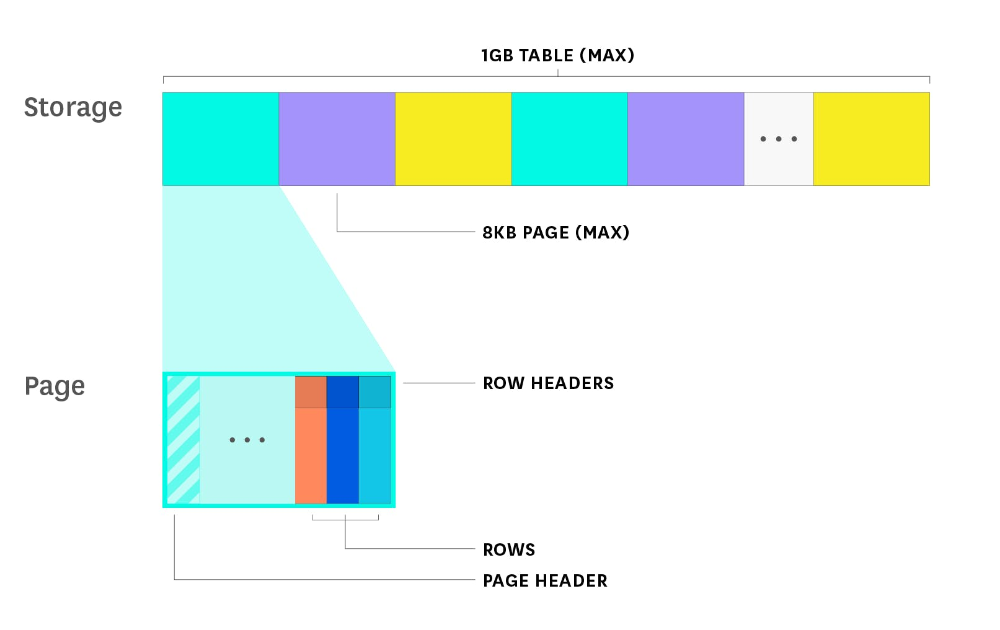

PostgreSQL의 작업은 아래 4가지의 메인 영역으로 구분 할 수 있다.
- [계획 및 쿼리 최적화](#읽기-쿼리-스루풋과-성능)
- [다중 버전 동시성 제어](#쓰기-쿼리의-처리량과-성능)를 사용한 데이터 업데이트 관리
- [공유 버퍼 캐시](https://www.datadoghq.com/blog/postgresql-monitoring/#shared-buffer-usage) 및 디스크 내 데이터 쿼리
- 메인 또는 하나 이상의 대기열로의 지속적인 [데이터 복제](https://www.datadoghq.com/blog/postgresql-monitoring/#replication-and-reliability)

해당 포인트들에 대한 자세한 설명은 이 글을 통해 설명할 예정이지만 그럼에도 안정적이고 신뢰성 있는 PostgreSQL 데이터베이스를 어떻게 구성하는지 간략하게 살펴보도록 하겠다.

PostgreSQL는 쿼리 플래너와 옵티마이저를 사용하여 각 쿼리의 가장 최적화 된 방법을 결정한다. 이러한 수행을 하기 위해서 데이터가 제대로 인덱싱이 되어있는지 부터 시작하여 해당 데이터베이스의 각 테이블에 적재된 로우의 갯수와 같은 [내부 통계](https://www.postgresql.org/docs/current/planner-stats.html)를 조사하는 등의 몇가지 요인들을 확인한다.

쿼리에 업데이트나 삭제등의 로직이 포함되어 있다면 PostgreSQL는 [다중 버전 동시성 제어](https://www.datadoghq.com/blog/postgresql-monitoring/#write-query-throughput-and-performance)(MVCC)를 사용하여 데이터가 접근 가능하고 일관성 있는지 보장한다. 이는 높은 동시성이 요구되는 환경에서도 동일하게 동작한다. 각 트랜직션은 각 시점의 트랜잭션에 해당되는 데이터베이스의 스냅샷에서 동작하는데 이는 앍기 쿼리가 쓰기 쿼리가 각각 분리되어 동작하기 위함이다.

쿼리 속도를 향상시키기 위해서 PostgreSQL은 데이터베이스 서버 메모리내 특정 시점을 [공유 버퍼 캐시](https://www.postgresql.org/docs/current/runtime-config-resource.html#GUC-SHARED-BUFFERS)(기본 128MB)로 활용하는데, 이는 최근에 접근한 블록을 메모리에 저장하기 위함이다. 데이터가 저장 또는 삭제된다면 PostgreSQL은 해당 수정사항을 선행 기입 로그(WAL, write-ahead log) 에 기록한다. 이때 WAL에 메모리에 저장된 해당 페이지를 "dirty" 로 표기한다. PostgreSQL은 주기적으로 체크포인트 프로세스를 동작 시키는데 이는 메모리 내 더티 체킹 된 페이지들을 청소하여 메모리 내 데이터가 메모리 뿐만 아니라 디스크 내에도 항상 최신화 되어있음을 보장하기 위함이다. 

<video src="https://imgix.datadoghq.com/img/blog/postgresql-monitoring/postgresql-monitoring-animation-compressed.mp4" width=860></>

PostgreSQL은 [데이터 신뢰성](https://www.datadoghq.com/blog/postgresql-monitoring/#replication-and-reliability)을 유지하기 위해 메인에 위치한 WAL에 각 트랜잭션을 로깅하고 주기적으로 디스크에 쓰기작업을 한다. 고가용성을 유지하기 위해선 메인 서버에 위치한 WAL의 업데이트를 하나 또는 여러대의 대기 서버와 통신을 해야한다.

이 글에서는 위에서 언급한 내용들 뿐만 아니라 PostgreSQL 모니터링을 위해서 알아야할 중요한 지표들을 좀 더 자세하게 설명할 예정이다. 이를 통해 사용중인 데이터베이스가 문제없이 동작하는지 이해 할 수 있을 것이다.

## PostgreSQL 모니터링을 위한 주요 지표

PostgreSQL은 상당한 양의 쿼리 활동 통계 데이터를 자동으로 수잡하지만 여기서는 건강하고 성능이 잘 나오는 데이터베이스 서버를 유지하기 위해 도움이 되는 통찰을 얻는데 도움이 되는 몇가지 지표들에 대해 중점을 두고 서술할 예정이다.

- [읽기 쿼리 스루풋(throughput)과 성능](#읽기-쿼리-스루풋과-성능)
- [쓰기 쿼리 스루풋과 성능](https://www.datadoghq.com/blog/postgresql-monitoring/#write-query-throughput-and-performance)
- [복제와 신뢰성](https://www.datadoghq.com/blog/postgresql-monitoring/#replication-and-reliability)
- [리소스 최적화](https://www.datadoghq.com/blog/postgresql-monitoring/#resource-utilization)

이 글에서 언급한 모든 지표들은 PostgreSQL의 [통계 수집기](https://www.postgresql.org/docs/current/monitoring-stats.html)와 기타 기본 소스들을 통해 확인 할 수 있다. 이 시리즈의 [다음 글](https://www.datadoghq.com/blog/postgresql-monitoring-tools/)에서는 해당 지표들을 어떻게 쿼리하고 시각화와 알림 전달을 위해 어떻게 수집하는지 설명하고자 한다.

이 글은 또한 지표 수집과 알림에 관한 프레임워크 기능을 제공하는 데이터독의 [Monitoring 101 시리즈](https://www.datadoghq.com/blog/monitoring-101-collecting-data/)를 인용하고 있다.

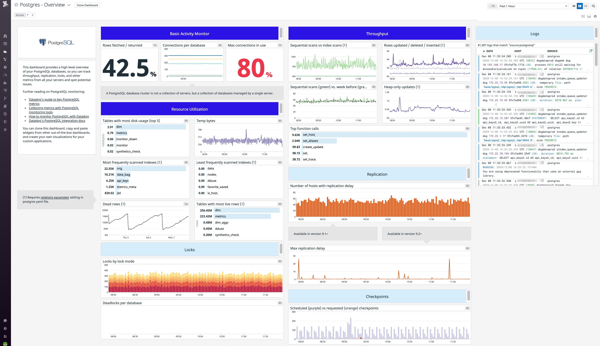

## 읽기 쿼리 스루풋과 성능
PostgreSQL는 어떻게 데이터베이스가 효율적으로 작업을 하는지 보여주기 위해 활동 내역들에 대한 내부 통계 데이터를 수집한다. 이 작업의 주요 항목중 하나는 읽기 쿼리의 스루풋(throughput)이다. 스루풋을 모니터링하게 되면 데이터베이스로부터 어플리케이션이 데이터를 접근 가능한지 여부를 확인 할 수 있다.

| Metric description | Name |	Metric type	| Availability |
|--------------------|------|-------------|--------------|
| 테이블내 인덱스 검색 수 | idx_scan | 기타 |	pg_stat_user_tables |
| 테이블 내 순차 검색 수 | seq_scan |	기타 |	pg_stat_user_tables |
| 데이터베이스에 쿼리를 실행하여 반환한 로우 대비 가져온 로우 수 | tup_fetched vs. tup_returned |	작업: 스루풋 | pg_stat_database |
| 쿼리를 실행하기 위해 디스크에 임시 저장된 데이터 양 (9.2 버전 이상) | temp_bytes | 원천: 포화상태 |	pg_stat_database |

**순차 검색 vs. 인덱스 검색:** 순차 검색하는 순간이 점점 늘어난다면 자주 접근되는 데이터에 [인덱스](https://www.postgresql.org/docs/current/sql-createindex.html)를 생성하여 성능을 향상시킬 수 있다. `EXPLAIN`을 붙여 쿼리를 실행함으로써 쿼리 플래너가 어떻게 데이터에 접근하는지에 대한 자세한 정보를 얻을 수 있다. 순차 검색은 전형적으로 인덱스 검색 보다 더 많은 시간을 소모하는데 이는 순차 검색이 로우 내 특정 지점을 가리키는 인덱스를 사용하지 않고 테이블의 각 로우들을 순차적으로 검색하기 때문이다. 하지만 쿼리 플래너는 테이블의 많은 부분을 반환해야된다고 판단하는 경우 인덱스 검색보다 순차 검색을 선호한다.

성능지표에 대한 항상 최신 정보가 필요하다면 순차 검색을 수행하는 경우를 지속적으로 수집하여 지표화할 수 있다. 이렇게 하면 저번주 대비 이번주에 순차 검색을 아래 그래프와 같이 비교 할 수 있다.

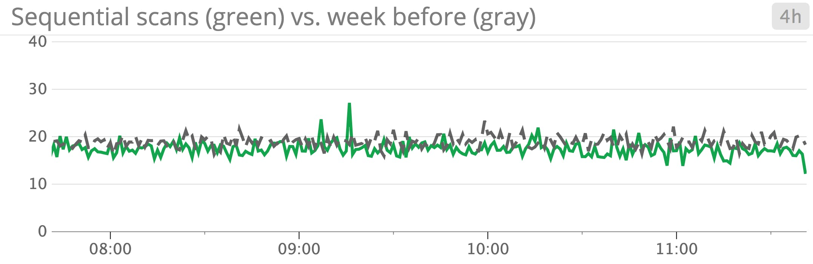

쿼리 플래너가 인덱스 검색보다 순차 검색을 선호하는 것이 잘못된 것이라고 생각한다면 `random_page_cost` 설정값(디스크내 임의의 페이지를 접근하는데 드는 예상 비용)을 살짝 변경해 볼 수 있다. [이 문서](https://www.postgresql.org/docs/current/runtime-config-query.html#GUC-RANDOM-PAGE-COST)에 따르면 `seq_page_cost`(이 값에 대해서는 다음 섹션에서 자세히 설명하겠다.) 대비해서 낮아진다면 쿼리 플래너가 인덱스 검색을 더 선호한다고 기술하고 있다. 여기서 기본 설정은 [90퍼센트 정도의 읽기 쿼리는 이미 메모리에 캐싱된 데이터를 접근 할 것](https://www.postgresql.org/docs/current/runtime-config-query.html#GUC-RANDOM-PAGE-COST)이라고 가정 하고 있다. 하지만 전용 데이터베이스 인스턴스를 실행중이고 전체 데이터베이스가 사용중인 메모리 용량에 적합하다면 임의 페이지 비용을 낮추어 좋은 결과를 얻을 수 있는지 확인 할 수 있다.

**가져온 로우 vs 데이터베이스에서 질의하여 반환된 로우:** 다소 혼란스럽게도 PostgreSQL은 클라이언트에 실제로 반환된 로우의 집합에 대한 정보가 아닌 읽기/스캔된 로우의 갯수를 `tup_returned` 로써 추적하고 있다. 오히려 `tup_fetched` 또는 "가져온 로우 수"는 실제 필요한 쿼리를 실행할 때 필요한 데이터가 포함된 로우가 얼마나 많이 반환하는지 계산하는 지표이다. 이상적으로는 가져온 로우의 갯수가 데이터베이스내에서 실제 반환된 로우의 갯수(읽기/검색)의 수치와 근접해야 한다. 아는 데이터베이스가 읽기 쿼리를 효율적으로 완료하고 있음을 나타내고 있다. 즉, 읽기 쿼리를 충족하기 위해 필요 이상으로 검색을 수행하지 않는다는 것이다.

아래 스크린샷에서 볼 수 있듯이 PostgreSQL은 특정 데이터베이스에서 검색(보라색 선)을 가져오는 것(초록색 선) 보다 많이 수행함을 알 수 있다. 이는 데이터가 적절하게 인덱싱 되어있지 않을 수도 있음을 나타낸다.

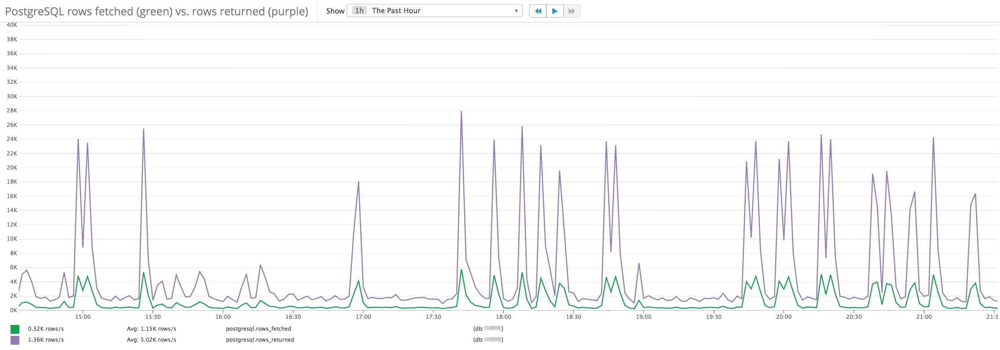

PostgreSQL은 쿼리가 인덱싱 되지 않은 컬럼에 접근할 필요가 없는 경우에만 인덱스 검색을 할 수 있다. 보통 자주 접근되는 컬럼에 인덱스를 추가하는 것은 검색 효율을 높이는데 도움이 된다. 하지만 각 인덱스는 공짜로 유지보수 되지 않는다. 특정 인덱스가 포함된 데이터가 추가, 변경 또는 삭제될 때마다 데이터베이스 내 추가적인 작업이 요구된다.

**쿼리를 실행하기 위해 임시로 디스크에 적재된 데이터의 양:** PostgreSQL은 쿼리를 실행하는데 필요한 정렬작업과 해시테이블을 사용하기 위해 `work_mem`(기본값으로 4MB 설정) 으로 지정된 일정량의 데이터를 메모리에 저장한다. `EXPLAIN ANALYZE`(이 내용은 [다음 섹션](https://www.datadoghq.com/blog/postgresql-monitoring/#postgresql-query-planner)에서 자세히 다루겠다.)을 사용하면 어느정도의 메모리가 쿼리 실행시 필요한지 측정 할 수 있다.

복잡한 쿼리를 사용하는 경우 `work_mem` 에서 설정한 메모리 값보다 더 많은 양을 요구하는데, 이 경우에는 특정 데이터를 임시로 디스크에 저장하는데, 이때 성능상의 부정적인 효과가 따라온더. 데이터가 자주 디스크에 저장된 파일에 접근하여 쓰게된다면 이는 곧 작업 리소스가 많이 필요한 쿼리를 실행함을 의미한다. 성능을 향상시키기 위해선 `work_mem` 사이즈를 키워야 한다. 중요한 점은 이 설정값을 높게 잡지 않는 것인데, 그 이유는 쿼리 플래너가 비효율적인 쿼리를 선택하게 될 수 있기 때문이다.

`work_mem` 을 높게 잡지 말아야하는 또 다른 이유는 작업별 설정을 꼽을 수 있다. 예를 들어 여러번의 정렬 작업이 필요한 복잡한 쿼리를 실행해야 하는 경우 각 실행 단계마다 `work_mem` 에 설정된 양 만큼의 메모리를 디스크에 임시 저장 하기전에 사용할 것이다. 너무 높은 수치의 `work_mem` 설정은 데이터베이스내 메모리를 많이 소모하여 동시 연결하여 많은 양의 데이터를 제공하기 충분한 양을 남겨놓지 않을 것이다. 이는 성능상의 부정적인 영향 또는 데이터베이스의 크래시를 불러이를 것이다.

### PostgreSQL 쿼리 플래너
스루풋 지표를 좀 더 잘 이해하고 싶다면 [쿼리 플래너/옵티마이저](https://www.postgresql.org/docs/current/planner-optimizer.html)가 어떻게 동작하는지 이해하면 도움이 된다. 쿼리 플래너/옵티마이저는 [내부 통계](https://www.postgresql.org/docs/current/planner-stats.html)(예를 들면 테이블 또는 인덱스 내 필드의 숫자)를 사용하여 수행된 다른 쿼리 플랜 대비 성능 측정을 하여 어떤 것이 더 효율적인지 판단한다. 항상 비교되는 하나의 플랜은 순차 검색이다.

`EXPLAIN` 명령어를 실행하면 해당 내부 통계에 대한 다양한 정보를 얻을 수 있다. 이를 통해 어떤 쿼리 플래너가 쿼리 측정을 위해 사용되는지 확인 할 수 있다.

```sql
EXPLAIN SELECT * FROM blog_article ORDER BY word_count;
                              QUERY PLAN
-----------------------------------------------------------------------
 Sort  (cost=337.48..348.14 rows=4261 width=31)
   Sort Key: word_count
   ->  Seq Scan on blog_article  (cost=0.00..80.61 rows=4261 width=31)
(3 rows)
```

플래너는 스캔해야 하는 로우의 갯수(4,261개)와 이 테이블이 저장된 블록 수와 같은 여러 요소를 사용하여 비용을 계산한다. `pg_class` 를 쿼리 하여 특정 테이블/관계(또는 `relname`)에 얼마나 많은 블록이 있는지 확인 할 수 있다.

```sql
SELECT relpages, reltuples FROM pg_class WHERE relname='blog_article';

 relpages | reltuples
----------+-----------
       38 |      4261
```
위 수치는 `blog_article` 테이블에 38 페이지 분량의 데이터, 즉 4,261 개의 튜플/로우가 저장되어 있음을 알 수 있다. 위 쿼리 플래너에서 순차 검색 비용을 계산하기 위해 플래너는 아래 공식을 사용했다.

```sql
순차검색 비용 = (읽은 페이지 수 * seq_page_cost) + (스캔한 로우의 갯수 * cpu_tuple_cost)
```
`seq_page_cost`가 순차검색을 하는 동안 디스크에서 페이를 가져오는 플래너의 예상 비용이라면 `cpu_tuple_cost`는 로우/튜플을 쿼리하는데 드는 CPU 비용에 대한 플래너의 예상 비용이다. 실제로 드는 순차 검색 배용은 디스크 하드웨어에 따라 다르다. 이 때문에 고성능 SSD를 사용한다면 디스크에서 페이지를 가져오는 비용이 하드디스크 드라이브에 데이터를 저장하는 비용보다 적을 수 있다. 필요에 따라 하드웨어 성능에 맞추기 위해 `seq_page_cost` 과 `cpu_tuple_cost` 값을 PostgreSQL 설정에서 조정 할 수 있다. 지금은 위 쿼리 계획에 드는 비용을 기본값을 활용할 것이다.

```sql
cost = (38 pages read * 1.0) + (4261 rows scanned * 0.01) = 80.61
```
`EXPLAIN` 키워드를 사용하면 쿼리를 실행하는데 드는 예상 시간이 아니라 예상 비용을 보여준다. 하지만 두 값이 높다면 쿼리 실행시간이 길어지기 때문에 상당한 연관관계가 있다.

[`EXPLAIN ANALYZE`](https://www.postgresql.org/docs/current/using-explain.html) 키워드를 쿼리에 실행하면 실제 쿼리를 실행함과 동시에 플래너가 예상한 쿼리 실행비용을 실제 쿼리 실행시간과 비교대조 할 것이다.

```sql
EXPLAIN ANALYZE SELECT * FROM blog_article ORDER BY word_count; QUERY PLAN
--------------------------------------------------------------------------------------------------
Sort (cost=337.48..348.14 rows=4261 width=31) (actual time=9.039..11.101 rows=4261 loops=1)
  Sort Key: word_count
  Sort Method: quicksort Memory: 525kB
  -> Seq Scan on blog_article (cost=0.00..80.61 rows=4261 width=31) (actual time=0.049..1.559 rows=4261 loops=1) Total runtime: 11.981 ms
(5 rows)
```
`EXPLAIN ANALYZE`를 사용하면 쿼리 플래너의 예상값이 실제 실행값(위 예제에서는 플래너의 예측과 동일하게 4,261개의 로우를 조회해야함.)과 얼마나 일치하는지 알 수 있다. 여기서 나온 결과값에 따르면 정렬 작업에 525KB의 메모리가 사용됨을 알 수 있다.(디스크에 임시로 데이터를 저장할 필요가 없다는 의미임.) `ANALYZE` 키워드를 사용할때 또 다른 장점은 데이터베이스에 실시간으로 업데이트 될 때마다 실행계획을 변경하는데 이를 반영한 최신의 내부 통계 로직을 쿼리 플래너/옵티마이저에 반영한다는 점이다.

`EXPLAIN ANALYZE` 를 사용하여 느린 쿼리를 트러블슈팅을 하는 것 이외에도 `EXPLAIN`을 사용하면 환경설정 파일에 있는 `auto_explain.log_min_duration`에 기재된 값에 따른 레이턴시 임계치를 초과하는 느린 쿼리의 결과값을 로깅하는데 유용하다. 아래 예시는 250ms 를 초괴하는 모든 SQL문의 `EXPLAIN` 실행 계획을 자동으로 저장하는 설정이다.

```
# postgresql.conf

auto_explain.log_min_duration = 250
```
`EXPLAIN`과 `EXPLAIN ANALYZE` 쿼리에 대해 좀 더 자세히 알고싶다면 [explain.depesz.com](https://explain.depesz.com/)과 같은 툴을 참고 할 수 있다.

## 쓰기 쿼리의 처리량과 성능
어플리케이션이 데이터베이스로부터 읽기를 보장하는것 이외에도 얼마나 효과적으로 데이터 쓰기/변경을 하는지도 모니터링 해야한다. 쓰기 처리중에 발생하는 문제나 비정상적인 변화는 보통 복제나 신뢰성과 같은 다른 주요 측면에 문제가 있음을 나타낸다. 그러므로 읽기 처리량을 모니터링 하는것은 데이터베이스 전반적인 상태와 가용성을 유지하려면 쓰기 처리량을 모니터링 하는것이 중요하다.

### PostgreSQL에 데이터 쓰기: MVCC
지표에 대해 좀 더 자세히 알아보기 전에 어떻게 PostgreSQL이 어떻게 [다중 버전 동시성 제어](https://www.postgresql.org/docs/current/mvcc-intro.html)(MVCC) 를 사용하여 동시에 작업이 진행되는 동안 서로 블로킹을 하지 않도록 보장하는지 한번 알아보자. 각 트랜잭션은 데이터베이스가 시작되었을 때 당시의 스냅샷을 기반으로 동작한다. 해당 작업을 수행하기 위해 각 `INSERT`, `UPDATE`, `DELETE` 트랜잭션에 고유의 트랜잭션 ID(XID)를 부여하여 어떤 로우가 트랜잭션에서 보이게 되는지 여부를 결정한다.

각 로우는 [`t_xmin` 과 `t_xmax` 값](https://github.com/postgres/postgres/blob/master/src/include/access/htup_details.h#L118)을 헤더에 포함한 메타데이터를 저장한다. 해당 값들은 어떤 트랜잭션 ID가 해당 로우의 데이터를 볼 수 있는지 결정한다. `t_xmin` 은 마지막으로 추가되거나 변경된 트랜잭션의 XID를 기록한다. 해당 로우가 아직 살아있고 (아직 삭제되지 않았다면) 해당 로우의 `t_xmax`값이 0이 되는 경우는 모든 트랜잭션에서 해당 로우의 값을 볼 수 있음을 의미한다. 만약 해당 값이 삭제되거나 변경된다면 해당 값이 이후의 `UPDATE` 또는 `DELETE` 트랜잭션에서 보이지 않게 된다.(즉, 이 XID는 `t_xmax` 보다 높은 값으로 선언된다.) `t_xmax` 값보다 이하의 XID를 가진 로우들을 "죽은 로우"라고 칭하는데 이는 삭제되거나 새로운 데이터로 변경되었기 때문이다.

MVCC가 배후에서 어떻게 동작하는지 좀 더 잘 이해하기 위해 아래 `DELETE` 작업의 다양한 단계에 대한 간단한 예시를 살펴보자. 우선 테이블을 생성하고 데이터를 추가해보자.

```sql
CREATE TABLE employees ( id SERIAL, name varchar, department varchar);
INSERT INTO employees (name, department) VALUES ('Sue', 'Sales'), ('Dan', 'Operations'), ('Snoop', 'Sales');
```
여기 employees 테이블을 살펴보자.

```sql
SELECT * FROM employees;

 id | name  | department
----+-------+------------
  1 | Sue   | Sales
  2 | Dan   | Operations
  3 | Snoop | Sales
(3 rows)
```
이제 [pageinspect module](https://www.postgresql.org/docs/current/pageinspect.html)를 사용하여 해당 페이지에 대해 자세히 살펴보자.

```sql
SELECT * FROM heap_page_items(get_raw_page('employees', 0));

 lp | lp_off | lp_flags | lp_len | t_xmin | t_xmax | t_field3 | t_ctid  | t_infomask2 | t_infomask | t_hoff | t_bits | t_oid |
----+--------+----------+--------+--------+--------+----------+--------+-------------+------------
  1  | 8152 | 1 | 38 | 730 | 0 | 0 | (0,1)  | 3 | 2306 | 24 |  |
  2  | 8104 | 1 | 43 | 730 | 0 | 0 | (0,2)  | 3 | 2306 | 24 |  |
  3  | 8064 | 1 | 40 | 730 | 0 | 0 | (0,3)  | 3 | 2306 | 24 |  |
(3 rows)
```
`t_xmin` 컬럼은 이전 단계에서 `INSERT`문을 사용하여 선언된 트랜잭션 ID(XID)이다.

이제 세일즈 부서에 소속된 사람들을 지우고 다시 질의를 해보자.

```sql
DELETE FROM employees WHERE department = 'Sales';
SELECT * FROM employees;

 id | name | department
----+------+------------
  2 | Dan  | Operations
(1 row)
```
삭제했지만 여전히 페이지를 검사할 때 삭제된 로우가 보임을 확인할 수 있다.

```sql
SELECT * FROM heap_page_items(get_raw_page('employees',0));

 lp | lp_off  | lp_flags | lp_len | t_xmin | t_xmax | t_field3 | t_ctid | t_infomask2 | t_infomask | t_hoff  | t_bits | t_oid
----+--------+---------+--------+--------+--------+---------+--------+-------------+------------+--------+--------+-------
  1 |   8152 |      1  |     38 |    730 |    731 |      0 | (0,1)   |      8195   |       1282 |     24 |        |
  2 |   8104 |      1  |     43 |    730 |      0 |      0 | (0,2)   |         3   |       2306 |     24 |        |
  3 |   8064 |      1  |     40 |    730 |    731 |      0 | (0,3)   |      8195   |       1282 |     24 |        |
(3 rows)
```
삭제되거나 죽은 로우들은 트랜잭션 ID(XID)가 `DELETE` 문이 실행되었을때(위 예시의 `t_xmax` 컬럼의 731) `t_xmax` 값과 동일함을 확인 할 수 있다. 이는 추후 발생하는 트랜잭션에서 위에 나타난 `t_xmax`보다 큰 XID 값이 선언 될 것이고 해당 트랜잭션은 더이상 죽은 로우들을 확인 할 수 없기 때문이다. 하지만 데이터베이스는 다음 `VACUUM` 프로세스(이 내용에 대해서는 이 섹션의 [아래](https://www.datadoghq.com/blog/postgresql-monitoring/#concurrent-operations-performance-metrics)에서 좀더 다루고자 한다.)가 죽은 로우들을 정리하기 전까지 순차 검색시 여전히 죽은 로우들을 포함하여 검색하게된다. 

### 쓰기 쿼리의 스루풋과 성능 지표
| 지표 설명 | 이름 | 지표 종류 | 확인 가능한 테이블 |
|--------------------|------|-------------|--------------|
| 쿼리에 의해(데이터베이스 당) 추가, 변경, 삭제된 된 로우 |	tup_inserted, tup_updated, tup_deleted |Work: Throughput | pg_stat_database |
| 쿼리에 의해(테이블 당) 추가, 변경, 삭제된 된 로우 |	n_tup_ins, n_tup_upd, n_tup_del |	Work: Throughput | pg_stat_user_tables |
| 힙에서만 업데이트 된(HOT) 튜플 | n_tup_hot_upd |	Work: Throughput | pg_stat_user_tables |
| 총 수행된 트랜잭션의 수 (commits + rollbacks) |	xact_commit + xact_rollback |	Work: Throughput | pg_stat_database |

### 눈여겨 보아야할 지표:
**추가, 변경, 삭제된 된 로우:** Monitoring the number of rows inserted, updated, and deleted can help give you an idea of what types of write queries your database is serving. If you see a high rate of updated and deleted rows, you should also keep a close eye on the number of dead rows, since an increase in dead rows indicates a problem with `VACUUM` processes, which can slow down your queries.

A sudden drop in throughput is concerning and [could be due to issues like locks](https://www.datadoghq.com/blog/postgresql-monitoring/#concurrent-operations-performance-metrics) on tables and/or rows that need to be accessed in order to make updates. Monitoring write activity along with other database metrics like locks can help you pinpoint the potential source of the throughput issue.

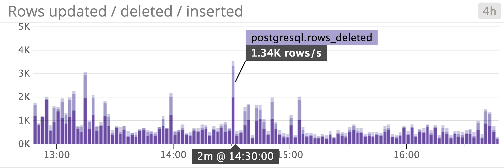

**Tuples updated vs. heap-only tuples (HOT) updated:** PostgreSQL will try to optimize updates when it is feasible to do so, through what's known as a [Heap-Only Tuple (HOT)](https://github.com/postgres/postgres/blob/master/src/backend/access/heap/README.HOT) update. A HOT update is possible when the transaction does not change any columns that are currently indexed (for example, if you created an index on the column `age`, but the update only affects the `name` column, which is not indexed).

In comparison with normal updates, a HOT update introduces less I/O load on the database, since it can update the row without having to update its associated index. In the next index scan, PostgreSQL will see a pointer in the old row that directs it to look at the new data instead. In general, you want to see more HOT updates over regular updates because they produce less load on the database. If you see a significantly higher number of updates than HOT updates, it may be due to frequent data updates in indexed columns. This issue will only continue to increase as your indexes grow in size and become more difficult to maintain.

### Concurrent operations performance metrics
PostgreSQL's statistics collector tracks several key metrics that pertain to concurrent operations. Tracking these metrics is an important part of PostgreSQL monitoring, helping you ensure that the database can scale sufficiently to be able to fulfill a high rate of queries. The `VACUUM` process is one of the most important maintenance tasks related to ensuring successful concurrent operations.

### Exploring the VACUUM process 
MVCC enables operations to occur concurrently by utilizing snapshots of the database (hence the "multi-version" aspect of MVCC), but the tradeoff is that it creates dead rows that eventually need to be cleaned up by running a `VACUUM` process.
The `VACUUM` process removes dead rows from tables and indexes and adds a marker to indicate that the space is available. Usually, the operating system will technically consider that disk space to be "in use," but PostgreSQL will still be able to use it to store updated and/or newly inserted data. In order to actually recover disk space to the OS, you need to run a [`VACUUM FULL`](https://www.postgresql.org/docs/9.6/routine-vacuuming.html) process, which is more resource-intensive, and requires an exclusive lock on each table as it works. If you do determine that you need to run a `VACUUM` FULL, you should do so during off-peak hours.

Routinely running `VACUUM` processes is crucial to maintaining efficient queries—not just because sequential scans have to scan through those dead rows, but also because `VACUUM` processes provide the query planner with updated internal statistics about tables, so that it can plan more efficient queries. To automate this process, you can enable the [autovacuum daemon](https://www.postgresql.org/docs/current/routine-vacuuming.html#AUTOVACUUM) to periodically run a `VACUUM` process whenever the number of dead rows in a table surpasses a specific threshold. This threshold is calculated based on a combination of factors:

- the `autovacuum_vacuum_threshold` (50, by default)
- the `autovacuum_vacuum_scale_factor` (0.2 or 20 percent, by default)
- the estimated number of rows in the table (based on the value of `pg_class.reltuples`)

The autovacuum daemon uses the following formula to calculate when it will trigger a `VACUUM` process on any particular table:

```
autovacuuming threshold = autovacuum_vacuum_threshold + autovacuum_vacuum_scale_factor * estimated number of rows in the table
```

For example, if a table contains an estimated 5,000 rows, the autovacuum daemon (configured using the default settings listed above) would launch a VACUUM on it whenever the number of dead rows in that table surpasses a threshold of `50 + 0.2 * 5000`, or `1,050`.

If it detects that a table has recently seen an increase in updates, the autovacuum process will run an `ANALYZE` command to gather statistics to help the query planner make more informed decisions. Each `VACUUM` process also updates the [visibility map](https://www.postgresql.org/docs/current/storage-vm.html), which shows which pages are visible to active transactions. This can improve the performance of index-only scans and will make the next `VACUUM` more efficient by enabling it to skip those pages. `VACUUM` processes can normally run concurrently with most operations like `SELECT/INSERT/UPDATE/DELETE` queries, but they may not be able to operate on a table if there is a lock-related conflict (e.g. due to an `ALTER TABLE` or `LOCK TABLE` operation).

| Metric description | Name |	Metric type |	Availability |
|--------------------|------|-------------|--------------|
| Locks	| lock | Other | pg_locks |
| Deadlocks (v. 9.2+) |	deadlocks |	Other |	pg_stat_database |
| Dead rows |	n_dead_tup | Other | pg_stat_user_tables |

### Metrics to watch
**Locks:** [PostgreSQL grants locks](https://www.postgresql.org/docs/current/explicit-locking.html) to certain transactions in order to ensure that data remains consistent across concurrent queries. You can also query the [`pg_locks` view](https://www.postgresql.org/docs/current/view-pg-locks.html) to see the active locks on the database, which objects have locks, and which processes are waiting to place locks on objects.

Viewing the number of locks per table, categorized by lock mode, can help ensure that you are able to access data consistently. Some types of lock modes, such as `ACCESS SHARE`, are less restrictive than others, like `ACCESS EXCLUSIVE` (which conflicts with every other type of lock), so it can be helpful to focus on monitoring the more restrictive lock modes. A high rate of locks in your database indicates that active connections could be building up from long-running queries, which will result in queries timing out.

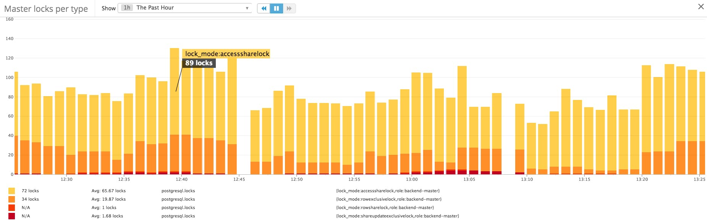

**Deadlocks:** A deadlock occurs when one or more transactions holds exclusive lock(s) on the same rows/tables that other transactions need in order to proceed. Let's say that transaction A has a row-level lock on row 1, and transaction B has a row-level lock on row 2. Transaction A then tries to update row 2, while transaction B requests a lock on row 1 to update a column value. Each transaction is forced to wait for the other transaction to release its lock before it can proceed.

In order for either transaction to complete, one of the transactions must be rolled back in order to release a lock on an object that the other transaction needs. PostgreSQL uses a [`deadlock_timeout`](https://www.postgresql.org/docs/current/runtime-config-locks.html) setting to determine how long it should wait for a lock before checking if there is a deadlock. The default is one second, but it's generally not advised to lower this, because checking for deadlocks uses up resources. The documentation advises that you should aim to avoid deadlocks by ensuring that your applications acquire locks in the same order all the time, to avoid conflicts.

**Dead rows:** If you have a vacuuming schedule in place (either through autovacuum or some other means), the number of dead rows should not be steadily increasing over time—this indicates that something is interfering with your `VACUUM` process. `VACUUM` processes can get blocked if there is a lock on the table/row that needs to be vacuumed. If you suspect that a `VACUUM` is stuck, you will need to investigate to see what is causing this slowdown, as it can lead to slower queries and increase the amount of disk space that PostgreSQL uses. Therefore, it's crucial to monitor the number of dead rows to ensure that your tables are being maintained with regular, periodic `VACUUM` processes.

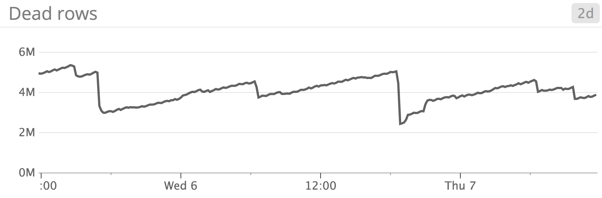

## Replication and reliability
As mentioned earlier, PostgreSQL writes and updates data by noting each transaction in the [write-ahead log (WAL)](https://www.postgresql.org/docs/current/wal-intro.html). In order to maintain data integrity without sacrificing too much performance, PostgreSQL only needs to record updates in the WAL and then commit the WAL (not the actual updated page/block) to disk to ensure data reliability in case the primary fails. After logging the transaction to the WAL, PostgreSQL will check if the block is in memory, and if so, it will update it in memory, marking it as a "dirty page."

The [`wal_buffers`](https://www.postgresql.org/docs/9.6/runtime-config-wal.html#GUC-WAL-BUFFERS) setting specifies the amount of shared memory that WAL can use to store data not yet written to disk. By default, PostgreSQL will set this value to about 3% of `shared_buffers`. You can adjust this setting, but keep in mind that it cannot be less than 64 KB, or greater than the size of one WAL segment (16 MB). The WAL is flushed to disk every time a transaction is committed. It is also flushed to disk either every [`wal_writer_delay`](https://www.postgresql.org/docs/9.6/runtime-config-wal.html#GUC-WAL-WRITER-DELAY) ms (200 ms, by default), or when the WAL reaches a certain size, as specified by `wal_writer_flush_after` (1 MB, by default). [According to the documentation](https://www.postgresql.org/docs/9.6/runtime-config-wal.html#GUC-WAL-WRITER-DELAY), the maximum window of potential data loss is actually about 3X the value of `wal_writer_delay`, because the WAL writer tries to optimize performance by writing whole pages to disk at a time when the database is very busy.

### WAL replication in PostgreSQL
Many users set up PostgreSQL to replicate WAL changes from each primary server to one or more standby servers, in order to improve performance by directing queries to specific pools of read-only standbys. Replication also makes the database highly available—if the primary server experiences a failure, the database will always be prepared to failover to a standby. Replication is typically achieved in any one of three ways:

**Streaming replication:** The primary server streams WAL updates to the standby as they come in. This method is asynchronous, which means that there is a slight delay between a transaction that has been committed in the primary and the same transaction taking effect in the standby.


**Cascading replication:** A standby server receives updates from the primary, and then communicates those updates to other standby servers. This method helps reduce the number of direct connections to the primary. This method of replication is also asynchronous.

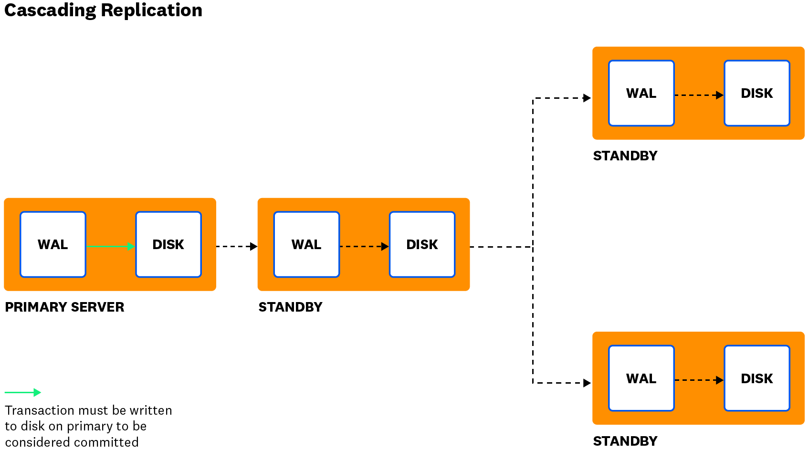

**Synchronous replication:** Available in PostgreSQL version 9.1+, this is the only method that ensures that every transaction on the primary is written to each standby server's WAL, and written to disk, before the transaction can be considered "committed." This is slower than the asynchronous methods, but it is the only method that ensures that data is always consistent across the primary and all standby servers, even in the event that the primary server crashes.

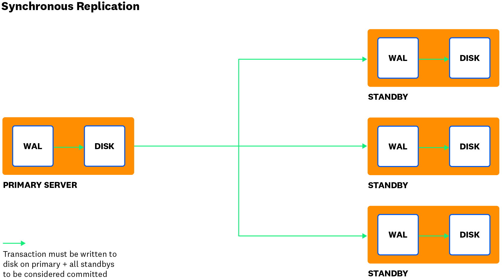

## Checkpoints and PostgreSQL reliability
Of course, the WAL is not the only file that needs to be committed to disk when data is inserted, updated, or deleted. [PostgreSQL's checkpoints](https://www.postgresql.org/docs/current/wal-configuration.html) are designed to periodically flush updated/dirty buffers (stored in memory) to disk. The WAL also notes each time a checkpoint completes, so that, in the event of a failure, the standby server will know where to pick up and start replaying transactions.

Checkpoints occur every [`checkpoint_timeout`](https://www.postgresql.org/docs/current/runtime-config-wal.html#GUC-CHECKPOINT-TIMEOUT) seconds (5 minutes by default), or when the WAL file reaches a certain size specified in your configuration settings. This setting was known as [`checkpoint_segments` prior to version 9.5](https://www.postgresql.org/docs/9.4/runtime-config-wal.html#GUC-CHECKPOINT-SEGMENTS) (~48 MB by default) , and renamed to [`max_wal_size`](https://www.postgresql.org/docs/9.6/runtime-config-wal.html#GUC-MAX-WAL-SIZE) in versions 9.5+ (1 GB by default). When either one of these settings is reached, it will trigger a checkpoint.

Checkpoint frequency is also influenced by the [`checkpoint_completion_target`](https://www.postgresql.org/docs/current/runtime-config-wal.html#GUC-CHECKPOINT-COMPLETION-TARGET) setting, which is specified as the ratio of how quickly a checkpoint should be completed in relation to the time between checkpoints. By default, it is 0.5, which means that it aims to complete the current checkpoint in about half the time between the current checkpoint and when the next checkpoint is estimated to run. This is designed to space out checkpoints to distribute the I/O load of writing data to disk.

### Replication & checkpoint metrics
| Metric description | Name |	Metric type |	Availability |
|--------------------|------|-------------|--------------|
| Replication delay (seconds) |	time elapsed since pg_last_xlog_replay_location() timestamp, or pg_last_wal_replay_lsn() in version 10+ |	Other |	pg_xlog |
| Number of checkpoints requested & scheduled |	checkpoints_req & checkpoints_timed |	Other	| pg_stat_bgwriter |
| Number of buffers written during checkpoints | buffers_checkpoint |	Other |	pg_stat_bgwriter |
| Number of buffers written by the background writer | buffers_clean | Other | pg_stat_bgwriter |
| Number of buffers written by backends |	buffers_backend	| Other |	pg_stat_bgwriter |

### Metric to alert on:
**Replication delay:** If you are running some form of asynchronous replication, tracking replication delay on each standby/replica server is important, because it helps you estimate how long it would take for your data to become consistent on a standby if your primary were to crash.

Replication delay is typically measured as the time delay between the last WAL update received from a primary, and the last WAL update applied/replayed on disk on that standby/replica. Collecting and graphing this metric over time is particularly insightful, as it tells you how consistently data is being updated across your replica servers.

For example, if you see that replication lag is increasing by one second, every second, on a standby that accepts read queries, that means that it hasn’t been receiving any new data updates, so it could be serving queries with stale or outdated data. PostgreSQL enables you to track replication lag in seconds (as of version 9.1) and bytes (as of version 9.2). We'll explain how to collect this metric in the [next part](https://www.datadoghq.com/blog/postgresql-monitoring-tools/) of this series.

If your data is constantly being updated, you should closely monitor replication lag on any standby/replica servers that are serving read queries, to ensure that they are not serving stale data. However, it's also important to monitor lag on standby servers that are not actively serving any queries, because they need to be prepared to step in quickly if the primary fails.

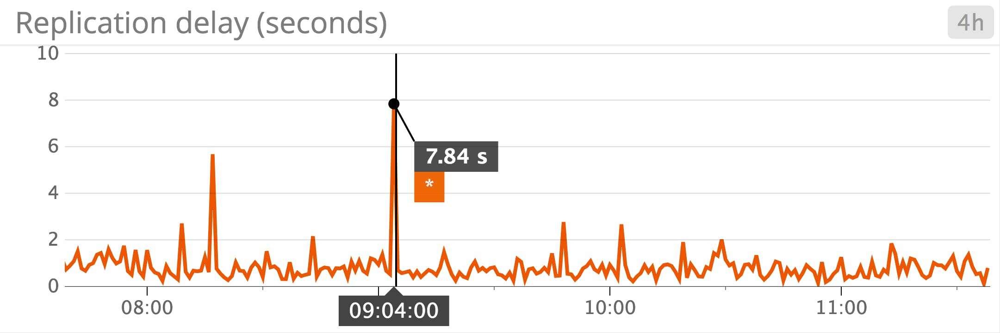

### Metrics to watch:
**Requested checkpoints:** If you see a high percentage of checkpoints being requested as opposed to time-based/scheduled, this tells you that WAL updates are reaching the `max_wal_size` or `checkpoint_segments` size before the `checkout_timeout` is reached. This indicates that your checkpoints can't keep up with the rate of data updates. Generally it's better for your databases' health if checkpoints are scheduled rather than requested, as the latter can indicate that your databases are under heavy load. Increasing `max_wal_size` or `checkpoint_segments` can help checkpoints become a time-driven process rather than a load-driven one, but only to a certain extent. If you are using a version prior to 9.5, the default `checkpoint_segments` setting is quite low, at 48 MB, so you can probably safely increase this up to 32 segments (or ~1 GB). As of version 9.5 and later, the default `max_wal_size` has already been raised to 1 GB.

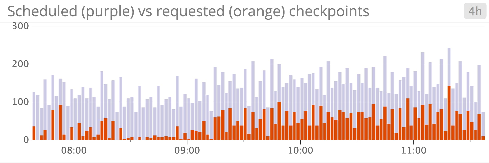

**Buffers written by checkpoints as percentage of total buffers written:** [`pg_stat_bgwriter`](https://www.datadoghq.com/blog/postgresql-monitoring-tools/#pg-stat-bgwriter) provides metrics for each of the three ways that PostgreSQL flushes dirty buffers to disk: via backends (`buffers_backend`), via the background writer (`buffers_clean`), or via the checkpoint process (buffers_checkpoint). PostgreSQL uses the [background writer](https://www.postgresql.org/docs/9.6/runtime-config-resource.html#RUNTIME-CONFIG-RESOURCE-BACKGROUND-WRITER) process to help lighten each checkpoint's I/O load by writing dirty shared buffers to disk periodically in between checkpoints. However, there are times when the background writer may increase I/O load unnecessarily—for instance, if you are updating the same page/block of data multiple times between checkpoints. If the background writer stepped in it would write the update to disk multiple times, whereas that update would normally have just been flushed once, during the next checkpoint.

If you see an increasing number of buffers being written directly by backends, this indicates that you have a write-heavy load that is generating dirty buffers so quickly that it can't keep up with the rate of checkpoints. It's generally better for performance if the majority of buffers are written to disk during checkpoints, as opposed to directly by backends or by the background writer.

## Resource utilization
Like any other database, PostgreSQL relies on many system resources to complete its work, including CPU, disk, memory, and network bandwidth. Monitoring these system-level metrics can help ensure that PostgreSQL has the resources it needs to respond to queries and update data throughout its tables and indexes. PostgreSQL also collects metrics about its own resource usage, including connections, shared buffer usage, and disk utilization, which we'll cover in more detail below.

### Connections
| Metric description | Name |	Metric type |	Availability |
|--------------------|------|-------------|--------------|
| Number of active connections | numbackends | Resource: Utilization | pg_stat_database |
| Percentage of max connections in use | numbackends as percentage of max_connections in pg_settings |Resource: Utilization |	pg_stat_database, pg_settings |
| Client connections waiting on a server connection (PgBouncer) |	cl_waiting | Resource: Saturation | PgBouncer |
| Max time a client connection has been waiting to be served (PgBouncer) | maxwait | Resource: Saturation |	PgBouncer |

The PostgreSQL primary server process forks a new process every time a client requests a connection. PostgreSQL sets a [`connection limit`](https://www.postgresql.org/docs/9.6/runtime-config-connection.html#GUC-MAX-CONNECTIONS), which determines the maximum number of connections that can be opened to the backend at any one time. However, note that the maximum number of connections may be lower, depending on the operating system's limits.

In high-concurrency environments, using a connection pool like [`PgBouncer`](http://www.pgbouncer.org/) can help distribute the number of direct connections to your primary server. The pool serves as a proxy between your applications and PostgreSQL backends.

If you see the number of active connections consistently approaching the number of maximum connections, this can indicate that applications are issuing long-running queries, and constantly creating new connections to send other requests, instead of reusing existing connections. Using a connection pool can help ensure that connections are consistently reused as they go idle, instead of placing load on the primary server to frequently have to open and close connections.

You can also set an [`idle_in_transaction_session_timeout`](https://www.postgresql.org/docs/current/runtime-config-client.html#GUC-IDLE-IN-TRANSACTION-SESSION-TIMEOUT) value to instruct PostgreSQL to close any connections that remain idle for the specified period of time. By default, this value is 0, which means that it is disabled.

### Shared buffer usage
| Metric description | Name |	Metric type |	Availability |
|--------------------|------|-------------|--------------|
| Blocks in this database that were shared buffer hits vs. read from disk |	blks_hit vs. blks_read | Other | pg_stat_database |
| Blocks in this table that were shared buffer hits vs. read from disk | heap_blks_hit vs. heap_blks_read |	Other |	pg_statio_user_tables |
| Blocks from indexes in this table that were shared buffer hits vs. read from disk |	idx_blks_hit vs. idx_blks_read | Other | pg_statio_user_tables |

When PostgreSQL reads or updates data, it checks for the block in the shared buffer cache first, and also in the OS cache, to see if it can serve the request without having to read from disk. If the block is not cached, it will need to access the data from disk, but it will cache it in the OS cache as well as the database's shared buffer cache so that the next time that data is queried, it won't need to access the disk. Inevitably, this means that some data will be cached in more than one place at any one time, so the [documentation recommends](https://www.postgresql.org/docs/current/runtime-config-resource.html#GUC-SHARED-BUFFERS) limiting `shared_buffers` to 25 percent of the OS memory.

[pg_statio](https://www.datadoghq.com/blog/postgresql-monitoring-tools/#pg-statio-user-tables) only provides statistics that pertain to the PostgreSQL shared buffer cache, not the OS cache. Therefore, if your cache hit rate looks low, it's important to remember that it doesn't account for pages that were hits in the OS cache, even they weren't hits in the shared buffer cache. While it is helpful to keep an eye on the cache hit rate, pg_statio only paints one side of the picture when it comes to PostgreSQL's actual memory usage. You should supplement PostgreSQL's pg_statio statistics with your kernel's I/O and memory utilization metrics to help paint a clearer picture of performance.

### Disk and index usage
| Metric description | Name |	Metric type |	Availability |
|--------------------|------|-------------|--------------|
Disk space used by indexes in the table |	pg_indexes_size	| Resource: Utilization |	[Database object management functions](https://www.postgresql.org/docs/current/functions-admin.html#FUNCTIONS-ADMIN-DBSIZE) |
| Disk space used by each table (excluding indexes) |	pg_table_size |	Resource: Utilization |	[Database object management functions](https://www.postgresql.org/docs/current/functions-admin.html#FUNCTIONS-ADMIN-DBSIZE) |
| Number of index scans initiated on this table or index | idx_scan |	Resource: Utilization |	pg_stat_user_tables or pg_stat_user_indexes |

PostgreSQL collects statistics internally to help you track the size of tables and indexes over time, which is helpful for gauging future changes in query performance. As your tables and indexes grow in size, queries will take longer, and indexes will require more disk space, which means that you either need to scale up the instance's disk space, [partition your data](https://www.postgresql.org/docs/current/ddl-partitioning.html), or rethink your indexing strategy. If you see any unexpected growth in table or index size, it may also point to problems with VACUUMs not running properly.

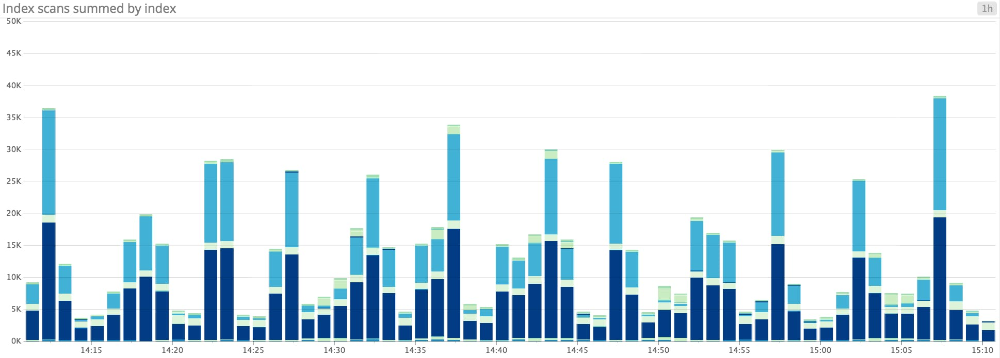

In the [next part](https://www.datadoghq.com/blog/postgresql-monitoring-tools/) of this series, we'll show you how to query pg_stat_user_indexes to see if there are any underutilized indexes that you could remove in order to free up disk space and decrease unnecessary load on the database. As mentioned in a previous section, indexes can be increasingly difficult to maintain as they grow in size, so it may not be worth applying resources to data that isn't queried very often.

## Next steps in PostgreSQL monitoring
In this post, we've covered an overview of PostgreSQL monitoring and its key performance metrics. As you continue to scale your PostgreSQL deployment over time, keeping an eye on these metrics will help you effectively detect and troubleshoot potential issues in real time. Read the [next part](https://www.datadoghq.com/blog/postgresql-monitoring-tools/) of this series to learn how to collect all of these metrics from PostgreSQL, or check out [Part 3](https://www.datadoghq.com/blog/collect-postgresql-data-with-datadog/) to learn how to monitor these metrics alongside distributed traces from your applications, all in one place.

Original Source:
[Key metrics for PostgreSQL monitoring](https://www.datadoghq.com/blog/postgresql-monitoring/#next-steps-in-postgresql-monitoring)
